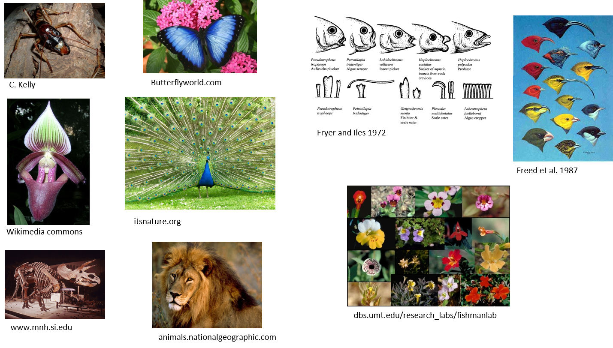

```{r setup, include=FALSE, echo = TRUE, tidy = TRUE}
library(knitr)
library(ape)
library(geomorph)
opts_chunk$set(echo = TRUE)
```

# Explaining Biodiversity

Biologists observe wondrous diversity in taxa and traits

```{r, echo = FALSE, out.width="90%"}

```


# Phenotypic Diversity

Morphometricians wish to explain the evolution of *phenotypic* diversity

```{r, echo = FALSE, out.width="45%"}
include_graphics(c("PCM-Image//MorphDiv1.png","PCM-Image/MorphDiv2.png"))

```

Our concern: how do we characterize patterns, and hypothesize processes in an evolutionary context?

# Comparative Biology Tradition

Trait correlations often used to study coevolution and adaptation

Species values commonly utilized

```{r, echo = FALSE, out.width="50%"}
include_graphics(c("pcm/11-PCM-Metab.png","pcm/11-PCM-PrimateCoev.png"))

```

> The problem? 

> Species are not independent of one another

# Phylogenetic Comparative Methods (PCMs)

Phylogenetic comparative methods *condition* the data on the phylogeny during the analysis

Allows one to assess trait covariation while accounting for the non-independence due to shared evolutionary history

```{r, echo = FALSE, out.width="80%"}
include_graphics("pcm/11-PCM-PCMConcept.png")  
```

# PCMs: An Incomplete Historical Walk

The conceptual development of PCMs

```{r, echo = FALSE, out.width="80%"}
include_graphics("pcm/11-PCM-MethodRoad.png")  
```


# Outline

* Phylogenetic regression/anova/association models

    + Phylogenetic Generalized Least Squares methods

    + Phylogenetic PLS


* Phylogenetic ordination

    + Phylomorphospace


* Exploring and modelling evolutionary processes

    + Phylogenetic signal

    + Evolutionary rates

    + Evolutionary models 

# PCMs: General Statistical Concepts

- PCMs condition the data on the phylogeny under an evolutionary model

- Data conditioning: Account for phylogenetic non-independence
    - (i.e., examine pattern ‘given’ the phylogeny)  

- Evolutionary model: How trait variation is expected to accumulate
    - Brownian motion (BM): A common null model of trait change
    - No change in $\small\mu$ but $\small\sigma^2\uparrow\propto{time}$
    
```{r echo = FALSE, eval=TRUE, out.width="30%",  results='hide'}
 nsim <- 100
  t <- 0:100  # time
  sig2 <- 0.005
  X <- matrix(rnorm(n = nsim * (length(t) - 1), sd = sqrt(sig2)), nsim, length(t) - 1)
  X <- cbind(rep(0, nsim), t(apply(X, 1, cumsum)))
  plot(t, X[1, ], xlab = "time", ylab = "phenotype", ylim = c(-2, 2), type = "l")
  apply(X[2:nsim, ], 1, function(x, t) lines(t, x), t = t)
```
    
# PCM: General Model

Most PCMs use GLS (generalized least squares) as a model:

$$\small\mathbf{Y}=\mathbf{X{\hat{\beta}}+\epsilon}$$
Here, $\small\epsilon$ is not *iid* but is $\small\sim\mathcal{N}(0,\textbf{V})$: containing expected covariation between taxa as described by the phylogeny (in matrix $\small\mathbf{V}$)

$\small\mathbf{V}$ is the *phylogenetic covariance matrix*

Describes the amount of evolutionary time species share via common ancestry (and thus how similar they are expected to be)

```{r, echo = FALSE, out.width="80%"}
include_graphics("pcm/11-PCM-PhyCovMat.png")  
```

###### Sometimes **V** is called **C** (particularly when derived under Brownian motion)

# PCM: General Model

$$\small\mathbf{Y}=\mathbf{X{\hat{\beta}}+\epsilon}$$

Model design ($\small\mathbf{X}$) describes the type of analysis

```{r, echo = FALSE, out.width="80%"}
include_graphics("pcm/ModelTypes.png")  
```

Parameters of model (and model significance) obtained in various ways

###### see Adams and Collyer. *Syst. Biol.* (2018); Adams and Collyer. *Ann. Rev. Ecol. Evol. Syst.* (2019)

# 1: Phylogenetic Regression 

Evaluate $\small\mathbf{Y}=\mathbf{X}\mathbf{\beta } +\mathbf{E}$   in a phylogenetic context

The workhorse of PCMs
      
```{r, echo = FALSE, out.width="80%"}
include_graphics("pcm/11-PCM-PhyloRegGarland.png")  
```

# 1: Phylogenetic Regression 

ANOVA and regression models that account for phylogeny

Requires a model of evolutionary change: typically **Brownian motion** (BM) 

# 1: Phylogenetic Regression 

ANOVA and regression models that account for phylogeny

Requires a model of evolutionary change: typically **Brownian motion** (BM) 

$\Delta\mu = 0$  

$\sigma^2$ (variance among taxa) $\uparrow$  $\propto$ time

```{r echo = FALSE, eval=TRUE, out.width="30%",  results='hide'}
 nsim <- 100
  t <- 0:100  # time
  sig2 <- 0.005
  X <- matrix(rnorm(n = nsim * (length(t) - 1), sd = sqrt(sig2)), nsim, length(t) - 1)
  X <- cbind(rep(0, nsim), t(apply(X, 1, cumsum)))
  plot(t, X[1, ], xlab = "time", ylab = "phenotype", ylim = c(-2, 2), type = "l")
  apply(X[2:nsim, ], 1, function(x, t) lines(t, x), t = t)
```

# 1: Phylogenetic Regression 

ANOVA and regression models that account for phylogeny

Requires a model of evolutionary change: typically **Brownian motion** (BM) 

$\Delta\mu = 0$  

$\sigma^2$ (variance among taxa) $\uparrow$  $\propto$ time

```{r echo = FALSE, eval=TRUE, out.width="30%",  results='hide'}
  plot(t, X[1, ], xlab = "time", ylab = "phenotype", ylim = c(-2, 2), type = "l")
  apply(X[2:nsim, ], 1, function(x, t) lines(t, x), t = t)
```

Statistical model: $\small\mathbf{Y}=\mathbf{X}\mathbf{\beta } +\mathbf{E}$ where $\small\mathbf{E} \sim \mathcal{N}(0,\textbf{V})$

Several implementations possible (yield identical results if implemented properly)

# Phylogenetically Independent Contrasts

Estimate contrast scores between pairs of taxa (tips or nodes)

Use contrasts for analyses (OLS solution)

```{r, echo = FALSE, out.width="40%"}
include_graphics("pcm/11-PCM-PIC1.png")  
```

###### see Felsenstein. *Am. Nat.* (1985)

# Phylogenetically Independent Contrasts

```{r, echo = FALSE, out.width="60%"}
include_graphics("pcm/11-PCM-PIC2.png")  
```

Coefficients found as: $\small\hat{\mathbf{\beta }}=\left ( \mathbf{X}^{T}_{pic} \mathbf{X}_{pic}\right )^{-1}\left ( \mathbf{X}^{T}_{pic} \mathbf{Y}_{pic}\right )$

# Phylogenetically Independent Contrasts: Example

```{r, echo = FALSE, out.width="30%"}
include_graphics("pcm/11-PCM-PICDataFig.png")  
```

What is the association between Y and X?

# Phylogenetically Independent Contrasts: Example

```{r echo = FALSE, eval=TRUE, out.width="30%"}
library(ape)
library(geiger)
n=8
tree<-compute.brlen(stree(n,type="left"), method=c(7,1,6,1,5,1,4,1,3,1,2,1,1,1))
X<-c(8,4,7,13,11,9,5,4)
names(X)<-tree$tip.label
Y<-c(3,2,5,9,7,8,4,1)
names(Y)<-tree$tip.label
pic.x<-pic(x=X,phy=tree) 
pic.y<-pic(x=Y,phy=tree) 
```

```{r, echo = FALSE, out.width="30%"}
include_graphics("pcm/11-PCM-PICDataFig.png")
plot(pic.y~pic.x, asp=1, cex=2, pch=21,bg="black")  
```

What is the association between Y and X?

```{r echo = FALSE, eval=TRUE, out.width="30%"}
anova(lm(pic.y~pic.x + 0))
coef(lm(pic.y~pic.x+0))
```

# Phylogenetic Generalized Least Squares (PGLS)

Use GLS model with non-independent error structure

Statistical model: $\small\mathbf{Y}=\mathbf{X}\mathbf{\beta } +\mathbf{E}$ where $\small\mathbf{E} \sim \mathcal{N}(0,\textbf{V})$

# Phylogenetic Generalized Least Squares (PGLS)

Use GLS model with non-independent error structure

Statistical model: $\small\mathbf{Y}=\mathbf{X}\mathbf{\beta } +\mathbf{E}$ where $\small\mathbf{E} \sim \mathcal{N}(0,\textbf{V})$

$\textbf{V}$ is the **phylogenetic covariance matrix**

Describes expected covariance among taxa due to shared evolutionary history (typically under BM)

```{r, echo = FALSE, out.width="40%"}
include_graphics("pcm/11-PCM-PhyCovMat.png")  
```

Coefficients found as: $\small\hat{\mathbf{\beta }}=\left ( \mathbf{X}^{T}  \mathbf{V}^{-1}  \mathbf{X}\right )^{-1}\left ( \mathbf{X}^{T} \mathbf{V}^{-1}\mathbf{Y}\right )$

###### see Grafen. *Phil. Trans. Roy. Soc.* (1989)

# PGLS: Example

```{r, echo = FALSE, out.width="30%"}
include_graphics("pcm/11-PCM-PICDataFig.png")
```

```{r echo = FALSE, eval=TRUE, out.width="30%"}
library(nlme)
bm.gls<-gls(Y~X, correlation=corBrownian(phy=tree), data=data.frame(Y,X))
anova(bm.gls)
coef(bm.gls)  #Here the correlation structure of the phylogeny is used
```

Identical results to PICs!

# Statistical Digression: OLS vs GLS

To understand what PGLS is doing, consider the following methods for obtaining model parameters

OLS model: $\small\hat{\mathbf{\beta }}=\left ( \mathbf{X}^{T}\mathbf{X}\right )^{-1}\left ( \mathbf{X}^{T} \mathbf{Y}\right )$

# Statistical Digression: OLS vs GLS

To understand what PGLS is doing, consider the following methods for obtaining model parameters

OLS model: $\small\hat{\mathbf{\beta }}=\left ( \mathbf{X}^{T}\mathbf{X}\right )^{-1}\left ( \mathbf{X}^{T} \mathbf{Y}\right )$

Unweighted GLS model:  $\small\hat{\mathbf{\beta }}=\left ( \mathbf{X}^{T}  \mathbf{V}_{id}^{-1}  \mathbf{X}\right )^{-1}\left ( \mathbf{X}^{T} \mathbf{V}_{id}^{-1}\mathbf{Y}\right )$  where 

$$\tiny\mathbf{V}_{id}= \left( \begin{array}{ccc} 1 & 0 & 0 \\ 0 & 1 & 0 \\ 0 & 0 & 1 \end{array} \right) $$


# Statistical Digression: OLS vs GLS

To understand what PGLS is doing, consider the following methods for obtaining model parameters

OLS model: $\small\hat{\mathbf{\beta }}=\left ( \mathbf{X}^{T}\mathbf{X}\right )^{-1}\left ( \mathbf{X}^{T} \mathbf{Y}\right )$

Unweighted GLS model:  $\small\hat{\mathbf{\beta }}=\left ( \mathbf{X}^{T}  \mathbf{V}_{id}^{-1}  \mathbf{X}\right )^{-1}\left ( \mathbf{X}^{T} \mathbf{V}_{id}^{-1}\mathbf{Y}\right )$  where 

$$\tiny\mathbf{V}_{id}= \left( \begin{array}{ccc} 1 & 0 & 0 \\ 0 & 1 & 0 \\ 0 & 0 & 1 \end{array} \right) $$


Weighted GLS model:  $\small\hat{\mathbf{\beta }}=\left ( \mathbf{X}^{T}  \mathbf{V}_{phy}^{-1}  \mathbf{X}\right )^{-1}\left ( \mathbf{X}^{T} \mathbf{V}_{phy}^{-1}\mathbf{Y}\right )$  where 

$$\tiny\mathbf{V}_{id}= \left( \begin{array}{ccc} (v_1+v_2) & v_{12} & 0 \\ v_{12} & (v_1+v_2) & 0 \\ 0 & 0 & 1 \end{array} \right) $$

In PGLS, the weights are the phylogenetic distances, which describe the phylogenetic non-independence

# Statistical Digression: OLS vs GLS

To understand what PGLS is doing, consider the following methods for obtaining model parameters

OLS model: $\small\hat{\mathbf{\beta }}=\left ( \mathbf{X}^{T}\mathbf{X}\right )^{-1}\left ( \mathbf{X}^{T} \mathbf{Y}\right )$

Unweighted GLS model:  $\small\hat{\mathbf{\beta }}=\left ( \mathbf{X}^{T}  \mathbf{V}_{id}^{-1}  \mathbf{X}\right )^{-1}\left ( \mathbf{X}^{T} \mathbf{V}_{id}^{-1}\mathbf{Y}\right )$  where 

$$\tiny\mathbf{V}_{id}= \left( \begin{array}{ccc} 1 & 0 & 0 \\ 0 & 1 & 0 \\ 0 & 0 & 1 \end{array} \right) $$


Weighted GLS model:  $\small\hat{\mathbf{\beta }}=\left ( \mathbf{X}^{T}  \mathbf{V}_{phy}^{-1}  \mathbf{X}\right )^{-1}\left ( \mathbf{X}^{T} \mathbf{V}_{phy}^{-1}\mathbf{Y}\right )$  where 

$$\tiny\mathbf{V}_{id}= \left( \begin{array}{ccc} (v_1+v_2) & v_{12} & 0 \\ v_{12} & (v_1+v_2) & 0 \\ 0 & 0 & 1 \end{array} \right) $$

In PGLS, the weights are the phylogenetic distances, which describe the phylogenetic non-independence

```{r, echo = FALSE, out.width="80%"}
include_graphics("pcm/PGLS-Attention.png")
```

# Phylogenetic Transformation

Utilize OLS transformation of GLS models 

Phylogenetic transformation matrix: $\small\mathbf{T}=\left ( \mathbf{U}\mathbf{W}^{-1/2}  \mathbf{U}^{T}\right )^{-1}$

**U** and **W** are eigenvectors and eigenvalues of **V**

Transformed data: $\small\tilde{\mathbf{Y}}=\mathbf{TY}$

Transformed design matrix: $\small\tilde{\mathbf{X}}=\mathbf{TX}$

Coefficients solved as: $\small\hat{\mathbf{\beta }}=\left ( \mathbf{\tilde{X}}^{T} \mathbf{\tilde{X}}\right )^{-1}\left ( \mathbf{\tilde{X}}^{T} \mathbf{\tilde{Y}}\right )$

###### see Garland and Ives. *Am. Nat.* (2000); Adams. *Evol.* (2014); Adams and Collyer. *Evol.* (2018)

# Phylogenetic Transformation: Example

```{r, echo = FALSE, out.width="30%"}
include_graphics("pcm/11-PCM-PICDataFig.png")
```

```{r echo = FALSE, eval=TRUE}
library(rgl)
library(geomorph)
pgls.res<-procD.pgls(Y~X,phy=tree,data=geomorph.data.frame(Y=Y,X=X), print.progress = FALSE) 
pgls.res$aov.table 
pgls.res$pgls.coefficients
```

Identical results to PICs & PGLS!

# Assessing Significance

PIC, PGLS, and Phylogenetic transform yield identical parameter estimates 

$$\tiny
\hat{\mathbf{\beta }}=\left ( \mathbf{X}^{T}  \mathbf{V}^{-1}  \mathbf{X}\right )^{-1}\left ( \mathbf{X}^{T} \mathbf{V}^{-1}\mathbf{Y}\right )$$

$$\tiny
=\left ( \mathbf{X}^{T}_{pic} \mathbf{X}_{pic}\right )^{-1}\left ( \mathbf{X}^{T}_{pic} \mathbf{Y}_{pic}\right )$$

$$\tiny
=\left ( \mathbf{\tilde{X}}^{T} \mathbf{\tilde{X}}\right )^{-1}\left ( \mathbf{\tilde{X}}^{T} \mathbf{\tilde{Y}}\right )$$

* Model significance typically accomplished using parametric procedures

    + F-ratios compared to parametric F-distribution

    + Optimize $\log{L}$ for model

$$\tiny
\log{L}=\log{
\left(\frac{exp{\left({-\frac{1}{2}{\left({\mathbf{Y}-E(\mathbf{Y})}\right)^{T}}}
\mathbf{V}^{-1}\left({\mathbf{Y}-E(\mathbf{Y})}\right)\right)}}
{\sqrt{\left({2\pi}\right)^{Np}\times\begin{vmatrix} \mathbf{V} \end{vmatrix}}}\right)}$$ 

# Assessing Significance

PROBLEM: Parametric significance testing suffers from Rao's paradox

Power reduces as *p*-dimensions increase

```{r, echo = FALSE, out.width="60%"}
include_graphics("pcm/11-PCM-PGLS-RaoParadox.png")
```

Another solution required

###### Adams. *Evol.* (2014); Adams and Collyer. *Syst. Biol.* (2018)

# Assessing Significance: RRPP

Transform data: $\small\tilde{\mathbf{Y}}=\mathbf{TY}$, 
$\small\tilde{\mathbf{X}}_{F}=\mathbf{TX}_{F}$, 
$\small\tilde{\mathbf{X}}_{R}=\mathbf{TX}_{R}$

Obtain Parameter estimates: $\small\hat{\mathbf{\beta }}=\left ( \mathbf{\tilde{X_{F}}}^{T} \mathbf{\tilde{X_{F}}}\right )^{-1}\left ( \mathbf{\tilde{X_{F}}}^{T} \mathbf{\tilde{Y}}\right )$, and permute residuals (as described previously)

# Assessing Significance: RRPP

Transform data: $\small\tilde{\mathbf{Y}}=\mathbf{TY}$, 
$\small\tilde{\mathbf{X}}_{F}=\mathbf{TX}_{F}$, 
$\small\tilde{\mathbf{X}}_{R}=\mathbf{TX}_{R}$

Obtain Parameter estimates: $\small\hat{\mathbf{\beta }}=\left ( \mathbf{\tilde{X_{F}}}^{T} \mathbf{\tilde{X_{F}}}\right )^{-1}\left ( \mathbf{\tilde{X_{F}}}^{T} \mathbf{\tilde{Y}}\right )$, and permute residuals (as described previously)

```{r, echo = FALSE, out.width="80%"}
include_graphics("pcm/11-PCM-PhyTransPower.png")
```

Appropriate for ANOVA, regression and more complex PGLS models with high-dimensional data (Adams & Collyer. *Evol.* 2018)

**RULE: Phylo-transform first, permute second!**

# Assessing Significance: RRPP

Transform data: $\small\tilde{\mathbf{Y}}=\mathbf{TY}$, 
$\small\tilde{\mathbf{X}}_{F}=\mathbf{TX}_{F}$, 
$\small\tilde{\mathbf{X}}_{R}=\mathbf{TX}_{R}$

Obtain Parameter estimates: $\small\hat{\mathbf{\beta }}=\left ( \mathbf{\tilde{X_{F}}}^{T} \mathbf{\tilde{X_{F}}}\right )^{-1}\left ( \mathbf{\tilde{X_{F}}}^{T} \mathbf{\tilde{Y}}\right )$, and permute residuals (as described previously)

```{r, echo = FALSE, out.width="80%"}
include_graphics("pcm/11-PCM-PhyTransPower.png")
```

Appropriate for ANOVA, regression and more complex PGLS models with high-dimensional data (Adams & Collyer. *Evol.* 2018)

**RULE: Phylo-transform first, permute second!**

##### Note: alternatives permuting PICs (Klingenberg and and Marugan-Loban 2013) are not correct (see Adams and Collyer 2015. Evolution).  

##### WHAT YOU SHUFFLE MATTERS! (must shuffle correct exchangeable units: see Adams and Collyer. *Evol.* 2015; Adams and Collyer. *Evol.* 2018)

# Phylogenetic Regression: Example

Does head shape covary with body size among *Plethodon* salamander species?

```{r echo = FALSE, eval=TRUE,out.width="40%"}
plethtree <- read.tree('pcm/plethtree.tre')
dat <- read.csv('pcm/svl.csv', header=TRUE, row.names=1)
svl <-dat[,1]; names(svl) <- rownames(dat)
shape <- readland.tps('pcm/headshape.tps',specID = "ID",warnmsg = FALSE)
plethgps <- read.csv('pcm/Gps.csv',header=TRUE, row.names=1)
  plethgps <- plethgps[match(dimnames(shape)[[3]],rownames(plethgps)),]
elev <- as.factor(plethgps$ElevGp); names(elev) <- rownames(plethgps)
  
gdf <- geomorph.data.frame(shape=shape, svl=svl,elev = elev, plethtree=plethtree)
links <- matrix(c(4,3,2,1,1,6,7,8,9,10,1,1,11,5,5,4,2,3,7,8,9,10,11,9,10,1),
                ncol=2,byrow=FALSE)
plot(ladderize(plethtree),edge.width=3)
axisPhylo(1)

plotAllSpecimens(shape,links=links)
```

# Phylogenetic Regression: Example

Are body dimensions associated with overall size across *Plethodon* salamander species?

```{r echo = FALSE, eval=TRUE,out.width="40%"}
plot(ladderize(plethtree),edge.width=3)
axisPhylo(1)

plotAllSpecimens(shape,links=links)

pgls.reg <- procD.pgls(f1 = shape~svl, effect.type = 'cohen', data=gdf,
                       phy=plethtree, print.progress = FALSE)
summary(pgls.reg)$table
```

YES! There is a significant association between head shape and body size in salamanders

# Phylogenetic ANOVA: Example

Does head shape differ between high-elevation and low-elevation salamander species?

```{r echo = FALSE, eval=TRUE,out.width="40%"}
plot(ladderize(plethtree),edge.width=3)
axisPhylo(1)

plotAllSpecimens(shape,links=links)
```


# Phylogenetic ANOVA: Example

Does head shape differ between high-elevation and low-elevation salamander species?

```{r echo = FALSE, eval=TRUE,out.width="40%"}
plot(ladderize(plethtree),edge.width=3)
axisPhylo(1)

plotAllSpecimens(shape,links=links)

pgls.aov <- procD.pgls(f1 = shape~elev, effect.type = 'cohen', data=gdf,
                       phy=plethtree, print.progress = FALSE)
summary(pgls.aov)$table
```

YES!  Head shape differs in high- and low-elevation species

# Phylogenetic ANOVA: Visualizations

One can visualize group dispersion in morphospace... 

##### BROKEN: don't know why

#```{r echo = FALSE, eval=TRUE,out.width="80%"}
#plot.res <- gm.prcomp(shape,phy=plethtree, data=gdf)
#ord.plot <- plot(plot.res,phylo = FALSE, pch=21, bg=gdf$elev, cex=1.5)
#shapeHulls(ord.plot, groups = gdf$elev, 
#           group.cols = c("red", "black"),
#           group.lwd = rep(1, 2), group.lty = c(2, 1))
#legend("topright", levels(gdf$elev), 
#       col = c("black", "red"),
#       lwd = rep(1,2), lty = c(2, 1))
#```

# Phylogenetic ANOVA: Visualizations

... and via TPS deformation grids

```{r echo = FALSE, eval=TRUE,out.width="100%"}
M <- mshape(shape)
Low <- c(1) # design for low elevation
High <- c(0) # design for high elevation
preds <- shape.predictor(arrayspecs(pgls.aov$pgls.fitted, 11,2), x= pgls.aov$X[,-1],
           Intercept = TRUE, Low = Low, High = High)   
par(mfrow=c(1,2)) 
plotRefToTarget(M, preds$Low, mag=2, links=links)
mtext("Low Elevation")
plotRefToTarget(M, preds$High, mag=2, links=links)
mtext("High Elevation")
par(mfrow=c(1,1)) 
```

# Phylogenetic ANOVA: Group Aggregation

How groups are distributed on the phylogeny can make a difference: Adams and Collyer. *Evol.* (2018)

```{r, echo = FALSE, }
include_graphics("pcm/11-PCM-PhyANOVA-Groups.png")
```

Too few group 'state' changes across phylogeny results in lower power
