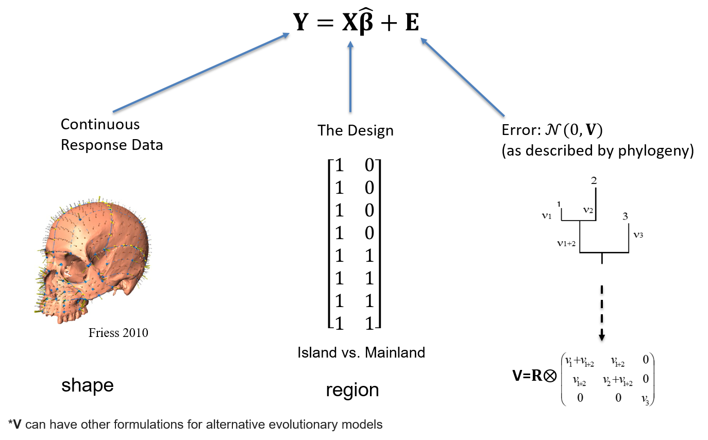

```{r setup, include=FALSE, echo = TRUE, tidy = TRUE}
library(knitr)
library(ape)
library(geiger)
library(geomorph)
library(phytools)
library(nlme)
opts_chunk$set(echo = TRUE)
```

# Phenotypic Diversity

Morphometricians wish to explain the evolution of *phenotypic* diversity

```{r, echo = FALSE, out.width="45%"}
include_graphics(c("PCM-Image//MorphDiv1.png","PCM-Image/MorphDiv2.png"))

```

How do we characterize patterns, and hypothesize processes in an evolutionary context?

# Macroevolution of Phenotypic Diversity

Understanding morphological trends requires:

```{r, echo = FALSE, out.width="90%"}


```

1: Methods for quantifying morphology (morphometrics)

2: Statistical models & tools for testing hypotheses in a phylogenetic framework

# Quantifying Phenotypes: The Procrustes Paradigm

GMM: A mathematical merger of statistical shape theory & analytics for extracting and analyzing shape from landmark data (via GPA)

```{r, echo = FALSE, out.width="90%"}


```

Procedures generate a set of shape variables for subsequent analyses*

<font size="2">* Note: considerable statistical theory was required to derive appropriate analytics for such data</font>

# Quantifying Phenotypes: The Procrustes Paradigm

GMM: A mathematical merger of statistical shape theory & analytics for extracting and analyzing shape from landmark data (via GPA)

```{r, echo = FALSE, out.width="90%"}


```

Procedures generate a set of shape variables for subsequent analyses*

<font size="2">* Note: considerable statistical theory was required to derive appropriate analytics for such data</font>

***How can we leverage GMM to address macroevolutionary hypotheses?***


# Comparative Biology Tradition

Trait correlations often used to study coevolution and adaptation
	
```{r, echo = FALSE, out.width="50%"}
include_graphics(c("PCM-Image/Metab.png","PCM-Image/PrimateCoev.png"))

```

The problem? Species are not independent of one another

One must account for this via phylogenetic comparative methods

# Why is There a Problem?

Let's simulate phenotypic traits on a phylogeny under Brownian motion:

```{r, echo = FALSE, eval=TRUE, out.width="60%", results='hide'}
tree <-stree(4,type ="b"); tree$edge.length =c(80,20,20,80,20,20)
plot(tree)
```

# Why is There a Problem?

```{r, echo = FALSE, eval=TRUE,  results='hide'}
par(mfrow=c(2,3))
t<-0:100 # time
sig2<-.01
for (j in 1:6){
  X <- lapply(tree$edge.length, function(x) c(0, cumsum(rnorm(n = x, sd = sqrt(sig2)))))
  cw <- reorder(tree)
  ll <- tree$edge.length + 1
  for (i in 1:nrow(cw$edge)) {
    pp <- which(cw$edge[, 2] == cw$edge[i, 1])
    if (length(pp) > 0) 
      X[[i]] <- X[[i]] + X[[pp]][ll[pp]] else X[[i]] <- X[[i]] + X[[1]][1]
  }
  H <- nodeHeights(tree)
  plot(H[1, 1], X[[1]][1], ylim = range(X), xlim = range(H), xlab = "time", ylab = "phenotype")
  for (i in 1:length(X)) lines(H[i, 1]:H[i, 2], X[[i]])  
}
par(mfrow=c(1,1))
```

Closely related species tend to resemble one another (i.e., $\small{E(\Sigma_{T1,T2})>0}$)

# A Worst Case Scenario

```{r, echo = FALSE, out.width="80%"}
  
```

Traits appear correlated, though simulated independently

# A Worst Case Scenario

```{r, echo = FALSE, out.width="80%"}
  
```

Traits appear correlated, though simulated independently

Conclusion: We must account for phylogeny during comparative analyses

# Phylogenetic Comparative Methods (PCMs)

PCMs *condition* the data on the phylogeny during the analysis 

Empirical Goal: Evaluate evolutionary hypotheses while accounting for (phylogenetic) non-independence

```{r, echo = FALSE, out.width="80%"}
include_graphics("PCM-Image/PCMConcept.png")  
```

Requires an evolutionary model of how trait variation is expected to accumulate

# PCMs: Brownian Motion

A useful null model of trait change
$\small\Delta\mu=0$ but $\small\sigma^2\uparrow\propto{time}$
    
```{r, echo = FALSE, out.width="40%"}
  
```

<font size="2">Side-note: this is the continuous-trait model equivalent of the Markov process, and is intimately related to Gaussian theory and the normal distribution </font>

<font size="3">see Felsenstein (1973; 1985) </font>

# PCMs: An Incomplete Historical Walk

The conceptual development of PCMs

```{r, echo = FALSE, out.width="80%"}
  
```

# Phylogenetic Comparative Method Toolkit

The methods of PCM: Analytical tools to address particular evolutionary hypotheses

```{r, echo = FALSE, out.width="80%"}
  
```

Today we will focus on **Phylogenetic Linear Models (regression/ANOVA)**

# PCM: General Model

Most PCMs use GLS (generalized least squares) as a model:

```{r, echo = FALSE, out.width="80%"}
  
```

$\small\mathbf{V}$ is the *phylogenetic covariance matrix*: it describes the amount of evolutionary time species share via common ancestry (and thus how similar they are expected to be)

<font size="2">Sometimes **V** is called **C** (particularly when derived under Brownian motion)</font>

# Motivating a Solution

One analytical solution can be appreciated by the following: 

```{r, echo = FALSE, out.width="80%"}
  
```

# Motivating a Solution

One analytical solution can be appreciated by the following: 

```{r, echo = FALSE, out.width="80%"}
  
```

From the circles above, one can envision a set of *contrasts* between sister taxa that are independent given the phylogeny (see Felsenstein 1985)

# Phylogenetically Independent Contrasts

Estimate contrast scores between pairs of taxa (tips or nodes)

Use contrasts for analyses (OLS solution)

```{r, echo = FALSE, out.width="40%"}
include_graphics(c("PCM-Image/PIC1.png","PCM-Image/PIC2.png"))
```

Coefficients found as: $\small\hat{\mathbf{\beta }}=\left ( \mathbf{X}^{T}_{pic} \mathbf{X}_{pic}\right )^{-1}\left ( \mathbf{X}^{T}_{pic} \mathbf{Y}_{pic}\right )$

<font size="3">see Felsenstein. *Am. Nat.* (1985)</font>

# Phylogenetically Independent Contrasts: Example

```{r echo = FALSE, eval=TRUE, out.width="30%"}
n=8
tree<-compute.brlen(stree(n,type="left"), method=c(7,1,6,1,5,1,4,1,3,1,2,1,1,1))
X<-c(8,4,7,13,11,9,5,4)
names(X)<-tree$tip.label
Y<-c(3,2,5,9,7,8,4,1)
names(Y)<-tree$tip.label
pic.x<-pic(x=X,phy=tree) 
pic.y<-pic(x=Y,phy=tree) 

plot(tree, show.tip.label = F, no.margin = TRUE)
tiplabels(Y, offset=-0.25, frame = "none", bg = NULL, cex=2)
tiplabels(X, offset=.1, frame = "none", bg = NULL, cex=2)
```

What is the association between Y and X?

```{r echo = FALSE, eval=TRUE, out.width="30%"}
anova(lm(pic.y~pic.x + 0))
coef(lm(pic.y~pic.x+0))
```


# Phylogenetic Generalized Least Squares (PGLS)

**Alternative implementation**: Use GLS model with non-independent error structure

Statistical model: $\small\mathbf{Y}=\mathbf{X}\mathbf{\beta } +\mathbf{E}$ where $\small\mathbf{E} \sim \mathcal{N}(0,\textbf{V})$

$\textbf{V}$ is the **phylogenetic covariance matrix**

```{r, echo = FALSE, out.width="40%"}
include_graphics("PCM-Image/PhyCovMat.png")  
```

Coefficients found as: $\small\hat{\mathbf{\beta }}=\left ( \mathbf{X}^{T}  \mathbf{V}^{-1}  \mathbf{X}\right )^{-1}\left ( \mathbf{X}^{T} \mathbf{V}^{-1}\mathbf{Y}\right )$

<font size="3">*Note: results identical to PIC (if implemented correctly)</font>

<font size="3">see Grafen. *Phil. Trans. Roy. Soc.* (1989)</font>

# PGLS: Example

```{r echo = FALSE, eval=TRUE, out.width="30%"}
plot(tree, show.tip.label = F, no.margin = TRUE)
tiplabels(Y, offset=-0.25, frame = "none", bg = NULL, cex=2)
tiplabels(X, offset=.1, frame = "none", bg = NULL, cex=2)

bm.gls<-gls(Y~X, correlation=corBrownian(phy=tree), data=data.frame(Y,X))
anova(bm.gls)
coef(bm.gls)  #Here the correlation structure of the phylogeny is used
```

Identical results to PICs!

# Phylogenetic Transformation

**Alternative implementation**: Utilize OLS transformation of GLS models 

Phylogenetic transformation matrix: $\small\mathbf{T}=\left ( \mathbf{U}\mathbf{W}^{-1/2}  \mathbf{U}^{T}\right )^{-1}$

**U** and **W** are eigenvectors and eigenvalues of **V**

Transformed data: $\small\tilde{\mathbf{Y}}=\mathbf{TY}$

Transformed design matrix: $\small\tilde{\mathbf{X}}=\mathbf{TX}$

Coefficients solved as: $\small\hat{\mathbf{\beta }}=\left ( \mathbf{\tilde{X}}^{T} \mathbf{\tilde{X}}\right )^{-1}\left ( \mathbf{\tilde{X}}^{T} \mathbf{\tilde{Y}}\right )$

<font size="3">*Note: results identical to PIC & PGLS (if implemented correctly)</font>

<font size="3">see Garland and Ives. *Am. Nat.* (2000); Adams. *Evol.* (2014); Adams and Collyer. *Evol.* (2018)</font>

# Phylogenetic Transformation: Example

```{r echo = FALSE, eval=TRUE, out.width="30%"}
plot(tree, show.tip.label = F, no.margin = TRUE)
tiplabels(Y, offset=-0.25, frame = "none", bg = NULL, cex=2)
tiplabels(X, offset=.1, frame = "none", bg = NULL, cex=2)
pgls.res<-procD.pgls(Y~X,phy=tree,data=geomorph.data.frame(Y=Y,X=X), print.progress = FALSE) 
pgls.res$aov.table 
pgls.res$pgls.coefficients
```

Identical results to PICs & PGLS!

# Assessing Significance

PIC, PGLS, and Phylogenetic transform yield identical parameter estimates 

$$\tiny
\hat{\mathbf{\beta }}=\left ( \mathbf{X}^{T}  \mathbf{V}^{-1}  \mathbf{X}\right )^{-1}\left ( \mathbf{X}^{T} \mathbf{V}^{-1}\mathbf{Y}\right )$$

$$\tiny
=\left ( \mathbf{X}^{T}_{pic} \mathbf{X}_{pic}\right )^{-1}\left ( \mathbf{X}^{T}_{pic} \mathbf{Y}_{pic}\right )$$

$$\tiny
=\left ( \mathbf{\tilde{X}}^{T} \mathbf{\tilde{X}}\right )^{-1}\left ( \mathbf{\tilde{X}}^{T} \mathbf{\tilde{Y}}\right )$$

* Model significance typically accomplished using parametric procedures (compare reduced [null] model to full model via):

    + F-ratios compared to parametric F-distribution

    + Compare $\log{L}$ for the two models

$$\tiny
\log{L}=\log{
\left(\frac{exp{\left({-\frac{1}{2}{\left({\mathbf{Y}-E(\mathbf{Y})}\right)^{T}}}
\mathbf{V}^{-1}\left({\mathbf{Y}-E(\mathbf{Y})}\right)\right)}}
{\sqrt{\left({2\pi}\right)^{Np}\times\begin{vmatrix} \mathbf{V} \end{vmatrix}}}\right)}$$ 

# Assessing Significance

PROBLEM: Parametric significance testing suffers from Rao's paradox

Power reduces as *p*-dimensions increase

```{r, echo = FALSE, out.width="60%"}
include_graphics("PCM-Image/PGLS-RaoParadox.png")
```

Why does this happen?

<font size="3">Adams. *Evol.* (2014); Adams and Collyer. *Syst. Biol.* (2018); Adams and Collyer. *Ann. Rev. Ecol. Evol. Syst.* (2019)</font>

# What's In a Likelihood?

One can understand this result by appreciating the likelihood equation: 

$$\tiny
\log{L}=\log{
\left(\frac{exp{\left({-\frac{1}{2}{\left({\mathbf{Y}-E(\mathbf{Y})}\right)^{T}}}
\mathbf{V}^{-1}\left({\mathbf{Y}-E(\mathbf{Y})}\right)\right)}}
{\sqrt{\left({2\pi}\right)^{Np}\times\begin{vmatrix} \mathbf{V} \end{vmatrix}}}\right)}$$ 

We see there are three components to $\small\log{L}$:

Element | Component      | Meaning                    
:------ | :------------- | :------------------------------------------
1 | $\tiny\frac{Np}{2}log{2\pi}$ | A constant
2 | $\tiny\frac{1}{2}{\left(\mathbf{Y}-E(\mathbf{Y})\right)^{T}\mathbf{V}^{-1}\left(\mathbf{Y}-E(\mathbf{Y})\right)}$ | Summed-squared deviations from the predicted values in some fashion 
3 | $\tiny\frac{1}{2}log\begin{vmatrix} \mathbf{V} \end{vmatrix}$ | The error covariance of the model

Surely #2 & #3 vary across different models? ... **WRONG!!** 

# Likelihood: Component Parts

Let's look at: $\tiny\frac{1}{2}{\left(\mathbf{Y}-E(\mathbf{Y})\right)^{T}\mathbf{V}^{-1}\left(\mathbf{Y}-E(\mathbf{Y})\right)}$ (univariate OLS example for simplicity):

$\tiny\tiny\mathbf{Y}=\begin{bmatrix} 
6\\ 7\\ 4\\ 5\\ 9\\ 3\\ 2\\ 5
\end{bmatrix}$  $\tiny\tiny\mathbf{X_{0}}=\begin{bmatrix} 
1\\ 1\\ 1\\ 1\\ 1\\ 1\\ 1\\ 1
\end{bmatrix}$ $\tiny\tiny\mathbf{X_{1}}=\begin{bmatrix} 
1 & 1\\ 1& 3\\ 1& 3\\ 1& 4\\ 1& 5\\ 1& 6\\ 1& 7\\ 1& 8
\end{bmatrix}$

```{r, echo=FALSE}
y<-c(6,7,4,5,9,3,2,5)
y1<-c(-5,0,5,2,-2,3,-3,1)
N<-length(y)
x<-rep(1,N)
x1<-cbind(x,c(1,2,3,4,5,6,7,8))
N<-length(y)
```

```{r}
beta<-solve(t(x)%*%x)%*%t(x)%*%y
sigma<-(t(y-x%*%beta)%*%(y-x%*%beta) ) / N
(t(y-x%*%beta)%*%(y-x%*%beta)) / (2*sigma)

beta1<-solve(t(x)%*%x)%*%t(x)%*%y
sigma1<-(t(y-x%*%beta1)%*%(y-x%*%beta1) ) / N
(t(y-x%*%beta1)%*%(y-x%*%beta1)) / (2*sigma1)
```

Wait! What? For two different models this component is *IDENTICAL*!

**ALGEBRA, please provide us with wisdom...**

# Likelihood: Component Parts

And algebra answers..."Yes I will!"

Say $\small\mathbf{X}$ is a vector of ones and $\small\mathbf{Y}$ is univariate. Then for OLS models $\small\mathbf{X\beta}$ is a vector of mean $\small\mu{Y}$

Thus, $\small{\left(\mathbf{Y}-\mathbf{X\beta}\right)^{T}\left(\mathbf{Y}-\mathbf{X\beta}\right)}$ is $\small\mathbf{SS}_{\epsilon}$

# Likelihood: Component Parts

And algebra answers..."Yes I will!"

Say $\small\mathbf{X}$ is a vector of ones and $\small\mathbf{Y}$ is univariate. Then for OLS models $\small\mathbf{X\beta}$ is a vector of mean $\small\mu{Y}$

Thus, $\small{\left(\mathbf{Y}-\mathbf{X\beta}\right)^{T}\left(\mathbf{Y}-\mathbf{X\beta}\right)}$ is $\small\mathbf{SS}_{\epsilon}$

- Next, recall that the MLE estimate: $\small\sigma^{2}= \frac{\mathbf{E}^{T}\mathbf{E}}{n}$, where   $\small\mathbf{E}^{T}\mathbf{E}=\left(\mathbf{Y}-\mathbf{X\beta}\right)^{T}\left(\mathbf{Y}-\mathbf{X\beta}\right)$

Thus we have: $\small\frac{1}{2\sigma^{2}}{\left(\mathbf{Y}-\mathbf{X\beta}\right)^{T}\left(\mathbf{Y}-\mathbf{X\beta}\right)}=\frac{\left(\mathbf{Y}-\mathbf{X\beta}\right)^{T}\left(\mathbf{Y}-\mathbf{X\beta}\right)}{2\frac{\mathbf{E}^{T}\mathbf{E}}{n}}$


# Likelihood: Component Parts

And algebra answers..."Yes I will!"

Say $\small\mathbf{X}$ is a vector of ones and $\small\mathbf{Y}$ is univariate. Then for OLS models $\small\mathbf{X\beta}$ is a vector of mean $\small\mu{Y}$

Thus, $\small{\left(\mathbf{Y}-\mathbf{X\beta}\right)^{T}\left(\mathbf{Y}-\mathbf{X\beta}\right)}$ is $\small\mathbf{SS}_{\epsilon}$

- Next, recall that the MLE estimate: $\small\sigma^{2}= \frac{\mathbf{E}^{T}\mathbf{E}}{n}$, where   $\small\mathbf{E}^{T}\mathbf{E}=\left(\mathbf{Y}-\mathbf{X\beta}\right)^{T}\left(\mathbf{Y}-\mathbf{X\beta}\right)$

Thus we have: $\small\frac{1}{2\sigma^{2}}{\left(\mathbf{Y}-\mathbf{X\beta}\right)^{T}\left(\mathbf{Y}-\mathbf{X\beta}\right)}=\frac{\left(\mathbf{Y}-\mathbf{X\beta}\right)^{T}\left(\mathbf{Y}-\mathbf{X\beta}\right)}{2\frac{\mathbf{E}^{T}\mathbf{E}}{n}}$

Re-arranging gives us $\small=\frac{\left(\mathbf{Y}-\mathbf{X\beta}\right)^{T}\left(\mathbf{Y}-\mathbf{X\beta}\right)}{\frac{2}{n}\left(\mathbf{Y}-\mathbf{X\beta}\right)^{T}\left(\mathbf{Y}-\mathbf{X\beta}\right)}=\frac{n}{2}$

REGARDLESS of the data in **Y** $\small\frac{1}{2\sigma^{2}}{\left(\mathbf{Y}-\mathbf{X\beta}\right)^{T}\left(\mathbf{Y}-\mathbf{X\beta}\right)}$ is the constant: $\small\frac{n}{2}$

<font size="3">This result holds multivariate and GLS models: where the general solution is: $\small\frac{np}{2}$.</font>

# Revisiting the Likelihood

Our likelihood thus contains: 

$$\tiny
\log{L}=\log{
\left(\frac{exp{\left({-\frac{1}{2}{\left({\mathbf{Y}-E(\mathbf{Y})}\right)^{T}}}
\mathbf{V}^{-1}\left({\mathbf{Y}-E(\mathbf{Y})}\right)\right)}}
{\sqrt{\left({2\pi}\right)^{Np}\times\begin{vmatrix} \mathbf{V} \end{vmatrix}}}\right)}$$ 

Element | Component      | Meaning                    
:------ | :------------- | :------------------------------------------
1 | $\tiny\frac{Np}{2}log{2\pi}$ | A constant
2 | $\tiny\frac{1}{2}{\left(\mathbf{Y}-E(\mathbf{Y})\right)^{T}\mathbf{V}^{-1}\left(\mathbf{Y}-E(\mathbf{Y})\right)}$ | A constant
3 | $\tiny\frac{1}{2}log\begin{vmatrix} \mathbf{V} \end{vmatrix}$ | The error covariance of the model

Thus, for parametric statistical hypothesis testing, all logL estimates (and by consequence derived summary measures such as AIC) are based on *ONE* component that is free to vary across models, $\small\frac{1}{2}log\begin{vmatrix} \mathbf{V} \end{vmatrix}$!

And this component becomes singular as $N\rightarrow{p}$!

# Revisiting the Likelihood

Our likelihood thus contains: 

$$\tiny
\log{L}=\log{
\left(\frac{exp{\left({-\frac{1}{2}{\left({\mathbf{Y}-E(\mathbf{Y})}\right)^{T}}}
\mathbf{V}^{-1}\left({\mathbf{Y}-E(\mathbf{Y})}\right)\right)}}
{\sqrt{\left({2\pi}\right)^{Np}\times\begin{vmatrix} \mathbf{V} \end{vmatrix}}}\right)}$$ 

Element | Component      | Meaning                    
:------ | :------------- | :------------------------------------------
1 | $\tiny\frac{Np}{2}log{2\pi}$ | A constant
2 | $\tiny\frac{1}{2}{\left(\mathbf{Y}-E(\mathbf{Y})\right)^{T}\mathbf{V}^{-1}\left(\mathbf{Y}-E(\mathbf{Y})\right)}$ | A constant
3 | $\tiny\frac{1}{2}log\begin{vmatrix} \mathbf{V} \end{vmatrix}$ | The error covariance of the model

Thus, for parametric statistical hypothesis testing, all logL estimates (and by consequence derived summary measures such as AIC) are based on *ONE* component that is free to vary across models, $\small\frac{1}{2}log\begin{vmatrix} \mathbf{V} \end{vmatrix}$!

And this component becomes singular as $N\rightarrow{p}$!

We need an alternative approach

# PCMs for Multivariate Data

Forgo standard ML and parametric approaches for statistical evaluation, and use robust methods

New GMM/PCM Approach:

1: Condition data on phylogeny & fit model parameters

2: Obtain robust summary measures (avoid $\begin{vmatrix} \mathbf{V} \end{vmatrix} = 0$)

3: Evaluate significance and effect sizes NOT using logL

# Condition Data on Phylogeny

We utilize the phylogenetic transformation procedure above

Phylogenetic transformation matrix: $\small\mathbf{T}=\left ( \mathbf{U}\mathbf{W}^{-1/2}  \mathbf{U}^{T}\right )^{-1}$

**U** and **W** are eigenvectors and eigenvalues of **V**

Transformed data: $\small\tilde{\mathbf{Y}}=\mathbf{TY}$

Transformed design matrix: $\small\tilde{\mathbf{X}}=\mathbf{TX}$

Coefficients solved as: $\small\hat{\mathbf{\beta }}=\left ( \mathbf{\tilde{X}}^{T} \mathbf{\tilde{X}}\right )^{-1}\left ( \mathbf{\tilde{X}}^{T} \mathbf{\tilde{Y}}\right )$

<font size="3">see Adams. *Evol.* (2014); Adams and Collyer. *Evol.* (2018)</font>

# Robust Summary Measures

Leverage geometry to obtain robust summary statistics

```{r, echo = FALSE, out.width="60%"}

```

One way: Sums-of-squares from object distances*

Avoids $\begin{vmatrix} \mathbf{V} \end{vmatrix} = 0$, but still obtains: $SS$, $MS$, $F$, $R^2$, etc.

<font size ="3">*Note: approach also used for Goodall’s F-test</font>

<font size ="3">See: Adams (2014a); Adams (2014b); Adams (2014c); Adams and Collyer (2015); (2018a, 2018b, 2019)</font>

# Assessing Significance: RRPP

```{r, echo = FALSE, out.width="90%"}

```

# Assessing Significance: RRPP

```{r, echo = FALSE, out.width="90%"}

```

# Assessing Significance: RRPP

```{r, echo = FALSE, out.width="90%"}

```

# RRPP and Power

```{r, echo = FALSE, out.width="90%"}

```

# RRPP Properties

```{r, echo = FALSE, out.width="90%"}

```

# Phylogenetic Regression: Example

Does head shape covary with body size among *Plethodon* salamander species?

```{r echo = FALSE, eval=TRUE,out.width="40%"}
plethtree <- read.tree('PCM-Image/plethtree.tre')
dat <- read.csv('PCM-Image/svl.csv', header=TRUE, row.names=1)
svl <-dat[,1]; names(svl) <- rownames(dat)
shape <- readland.tps('PCM-Image/headshape.tps',specID = "ID",warnmsg = FALSE)
plethgps <- read.csv('PCM-Image/Gps.csv',header=TRUE, row.names=1)
  plethgps <- plethgps[match(dimnames(shape)[[3]],rownames(plethgps)),]
elev <- as.factor(plethgps$ElevGp); names(elev) <- rownames(plethgps)
  
gdf <- geomorph.data.frame(shape=shape, svl=svl,elev = elev, plethtree=plethtree)
links <- matrix(c(4,3,2,1,1,6,7,8,9,10,1,1,11,5,5,4,2,3,7,8,9,10,11,9,10,1),
                ncol=2,byrow=FALSE)
plot(ladderize(plethtree),edge.width=3)
axisPhylo(1)

plotAllSpecimens(shape,links=links)

pgls.reg <- procD.pgls(f1 = shape~svl, effect.type = 'cohen', data=gdf,
                       phy=plethtree, print.progress = FALSE)
summary(pgls.reg)$table
```

YES! There is a significant association between head shape and body size in salamanders

# Phylogenetic Linear Models & GM-Data

Phylogenetic transformation + RRPP provides analytical generalization of PCMs for high-dimensional data

All manner of linear models can be envisioned: phylogenetic regression, ANOVA, factorial models, etc. 

Provides analytical tool for evaluating macroevolutionary trends of shape change in a phylogenetic context

**Sets the stage for the development of other PCMMs (perhaps the subject of future discussions)**