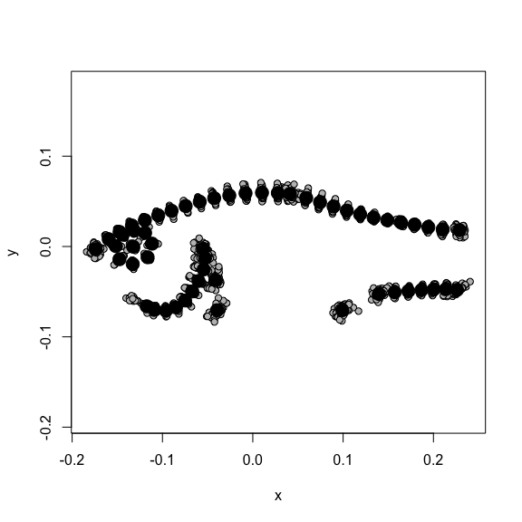
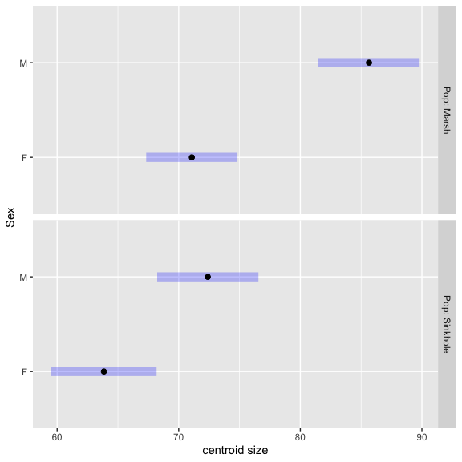
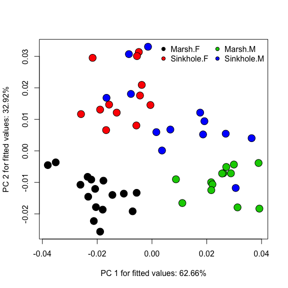

## Public Service announcement for `R`

- Beginning in version 4.x (just came out), default behaviour of `read.*` functions (`read.table`, `read.csv`) have changed for strings (characters).
- previously default was `stringsasFactors = TRUE`, i.e


```r
default.stringsAsFactors()
```

```
## [1] TRUE
```

- If this returns `TRUE`, then it is the old behaviour, if it is `FALSE`, it means that strings (characters) stay as strings and have to be converted to factors. 
- Most older code assumes this defaults `TRUE`. You may want to make sure (or just change all relevant variables to factors).

## Public Service announcement for `R`


```r
#dat_in <- read.csv(file, stringsAsFactors = TRUE)
```

- to maintain old behaviour

- Or change relevant variables to factors, but be mindful with old scripts.

## geomorph documentation
- After the tutorial today you may want to re-examine the examples in geomorph and RRPP. 
- Also see the [vignette](https://cran.r-project.org/web/packages/geomorph/vignettes/geomorph.assistance.html)

## A little bit of an introduction to using pairwise()

- Why do pairwise contrasts at all?
- Thinking a bit about how RRPP "works" (in general)
- Pairwise contrasts in other contexts
- What "reduced model" is pairwise() guessing at, and how to find it.
- The type of sum of squares (SS) influences which reduced model is used in RRPP.
- setting your null model in `pairwise()`. (I would always recommend doing this.)
- What is the pairwise table telling us

## Example for today - pupfish

- We will use the Collyer pupfish example from geomorph (may one day be as famous as the Bumpus sparrow or Fisher Iris data). 

- As well I have modified some examples from the geomorph examples and vignettes (so it is easy to look up and compare).

<!-- -->

- examining centroid size and shape across sex (sexual dimorphism) and two populations.


## Why might you want/need more than just the summary anova table? 
>- Want to understand and quantify the nature of differences between groups within and between predictors.

>- If more than 2 groups in a categorical predictor, which contribute to observed effects.

>- For shape, understanding direction vs. magnitude of effects


## Thinking about the basics
- before we think about shape data, let's think about pairwise contrasts more generally in a simple (univariate) case.
- Don't worry, as you will see the ideas generalize well!


## Modeling variation in size - the data


```r
pupfish_dat <- with(pupfish, data.frame(CS, Pop, Sex))
head(pupfish_dat)
```

```
##     CS   Pop Sex
## 1 63.7 Marsh   F
## 2 66.0 Marsh   F
## 3 65.2 Marsh   F
## 4 68.6 Marsh   F
## 5 68.8 Marsh   F
## 6 72.8 Marsh   F
```

```r
str(pupfish_dat)
```

```
## 'data.frame':	54 obs. of  3 variables:
##  $ CS : num  63.7 66 65.2 68.6 68.8 ...
##  $ Pop: Factor w/ 2 levels "Marsh","Sinkhole": 1 1 1 1 1 1 1 1 1 1 ...
##  $ Sex: Factor w/ 2 levels "F","M": 1 1 1 1 1 1 1 1 1 1 ...
```

## Modeling variation in size - fitting the model


```r
cs_model_fit_lm <- lm(CS ~ 1 + Sex + Pop + Sex:Pop, # or Sex*Pop
    data = pupfish_dat)
```

## Modeling variation in size - model estimates


```
## 
## Call:
## lm(formula = CS ~ 1 + Sex + Pop + Sex:Pop, data = pupfish_dat)
## 
## Residuals:
##     Min      1Q  Median      3Q     Max 
## -19.919  -3.751   0.101   5.240  13.760 
## 
## Coefficients:
##                  Estimate Std. Error t value Pr(>|t|)
## (Intercept)         71.08       1.87   38.04  < 2e-16
## SexM                14.57       2.79    5.22  3.4e-06
## PopSinkhole         -7.23       2.85   -2.53    0.014
## SexM:PopSinkhole    -6.02       4.09   -1.47    0.147
## 
## Residual standard error: 7.47 on 50 degrees of freedom
## Multiple R-squared:  0.53,	Adjusted R-squared:  0.501 
## F-statistic: 18.8 on 3 and 50 DF,  p-value: 2.74e-08
```

- R uses treatment contrasts coding by default.
- Don't worry (for the purposes of demonstration) that the interaction term is not significant.

## Modeling variation in size - ANOVA table


```r
Anova(cs_model_fit_lm) 
```

```
## Anova Table (Type II tests)
## 
## Response: CS
##           Sum Sq Df F value  Pr(>F)
## Sex         1857  1   33.25 5.0e-07
## Pop         1380  1   24.70 8.2e-06
## Sex:Pop      121  1    2.17    0.15
## Residuals   2793 50
```

## thinking about pairwise contrasts to examine sexual size dimorphism (SSD)

>- We are interested in pairwise contrasts for SSD **within** each population.
>- Many ways to do this (In base `R` & additional libraries).
>- alternative ways adjust estimates, sampling variation (uncertainty) or both.  

## But before we examine the pairwise contrasts let's review
- What goes into a $t$-test? i.e. what is the numerator? Denominator?

>- $\frac{\bar{x}_a - \bar{x}_b } { \sqrt{ \frac{s^{2}_{a}} {n_a} + \frac{s^{2}_{b}} {n_b} }}$
>- $\bar{x}_a$ is the mean for group $a$, $\bar{x}_b$ for group $b$
>- The denominator is just the *pooled standard error of the mean*, $s_{p}$
>- There are 4 critical things:
>- $\alpha$, the difference between means $\Delta = \bar{x}_a - \bar{x}_b$, $n$ and $s_{p}$

## looking at sexual dimorphism within each population


```r
estimates_cs_model_fit <- emmeans(cs_model_fit_lm, ~ Sex | Pop)
plot(estimates_cs_model_fit, xlab = "centroid size")
```

<!-- -->

## looking at sexual dimorphism within each population

```r
pairs(estimates_cs_model_fit)
```

```
## Pop = Marsh:
##  contrast estimate   SE df t.ratio p.value
##  F - M      -14.57 2.79 50 -5.220  <.0001 
## 
## Pop = Sinkhole:
##  contrast estimate   SE df t.ratio p.value
##  F - M       -8.55 2.99 50 -2.860  0.0062
```
>- What are these contrasts? Sex differences computed using model adjusted estimates of size by population. 
>- For this simple model and assuming estimates are close to independent (not shown), these would be similar to unadjusted t-tests.
>- As the model gets complicated, with correlations among predictors, uncertainty (i.e. sampling variation summarized in the s.e.) also gets complicated.

## What does this have to do with pairwise in RRPP?
- Consider this same model, but using lm.rrpp


```r
CS_mod_rrpp <- lm.rrpp(CS ~ Pop + Sex + Pop:Sex, # can just use model name we fit above
    data = pupfish_dat, iter = 999, 
    SS.type = "I", #type I SS is sequential, order of predictors matters!
    print.progress = FALSE )
```

## ANOVA from the model (RRPP)

```
## 
## Analysis of Variance, using Residual Randomization
## Permutation procedure: Randomization of null model residuals 
## Number of permutations: 1000 
## Estimation method: Ordinary Least Squares 
## Sums of Squares and Cross-products: Type I 
## Effect sizes (Z) based on F distributions
## 
##           Df   SS   MS   Rsq     F     Z Pr(>F)
## Pop        1 1166 1166 0.196 20.88 1.961  0.001
## Sex        1 1857 1857 0.313 33.25 2.157  0.001
## Pop:Sex    1  121  121 0.020  2.17 0.917  0.161
## Residuals 50 2793   56 0.470                   
## Total     53 5937                              
## 
## Call: lm.rrpp(f1 = CS ~ Pop + Sex + Pop:Sex, iter = 999, SS.type = "I",  
##     data = pupfish_dat, print.progress = FALSE)
```

## What does RRPP do

>- Let's remind ourselves of how RRPP evaluates uncertainty.
>- Uses a type of a permutation/randomization test. 
>- fits a reduced model (we will see this in a second) with one (or more) fewer predictors being modeled relative to full model. 
>- The residuals from this model are permuted (shuffled) and added back to fitted values from reduced model.
>- This is our set of "new" observations. 

## What does RRPP do (part II)
>- Using the "new" observations, fit the full model (including predictors of interest).

>- Because of the randomization of the residuals, there should be no association between predictors NOT initally included in reduced model, and fit of the new observations in the new model. i.e. the non-zero estimated effects is do to sampling variation.
>- Using this approach, it can evaluate any number of test statistics, which will become relevant for pairwise.

## But we REALLY need to understand what reduced model is being used
- How does RRPP choose the model? 

```r
reveal.model.designs(CS_mod_rrpp)
```

```
##            Reduced                 Full                                  
## Pop              1                  Pop                                  
## Sex            Pop            Pop + Sex                                  
## Pop:Sex  Pop + Sex  Pop + Sex + Pop:Sex <- Null/Full inherent in pairwise
```

>- Reduced model fit for Pop term is a model with just the intercept (no effect of sex)
>- Reduced model for the Sex term is a model with intercept and Pop.
>- If the predictors are independent (orthogonal) it will not matter much which order they enter the model.
>- If they are correlated (due to biology or experimental design, included unbalanced designs) order matters!

## the type of sum of squares (SS) influences the choice of reduced model

- there are different approaches than just the sequential (type I SS) approach.
- For type II SS, main effects are all adjusted "equally", while interaction effects are adjusted for all main effects.


```r
CS_mod_rrpp_typeII <- lm.rrpp(CS ~ Pop + Sex + Pop:Sex,
    data = pupfish_dat, iter = 999, 
    SS.type = "II", # type II SS
    print.progress = FALSE)

reveal.model.designs(CS_mod_rrpp_typeII)
```

```
##            Reduced                 Full                                  
## Pop            Sex            Pop + Sex                                  
## Sex            Pop            Pop + Sex                                  
## Pop:Sex  Pop + Sex  Pop + Sex + Pop:Sex <- Null/Full inherent in pairwise
```

>- Pop is adjusted accounting for the effects of Sex
>- Sex is adjusted accounting for the effects of Pop
>- Pop:Sex is adjusted accounting for the effects of Pop + Sex

## ANOVA for the type II SS (RRPP)

```
## 
## Analysis of Variance, using Residual Randomization
## Permutation procedure: Randomization of null model residuals 
## Number of permutations: 1000 
## Estimation method: Ordinary Least Squares 
## Sums of Squares and Cross-products: Type II 
## Effect sizes (Z) based on F distributions
## 
##           Df   SS   MS   Rsq     F     Z Pr(>F)
## Pop        1 1380 1380 0.232 24.70 1.990  0.001
## Sex        1 1857 1857 0.313 33.25 2.157  0.001
## Pop:Sex    1  121  121 0.020  2.17 0.917  0.161
## Residuals 50 2793   56 0.470                   
## Total     53 5937                              
## 
## Call: lm.rrpp(f1 = CS ~ Pop + Sex + Pop:Sex, iter = 999, SS.type = "II",  
##     data = pupfish_dat, print.progress = FALSE)
```

## type III SS is agnostic to whether effects are "main" or interaction 
- It adjusts ALL terms accounting for all other terms in the model.
-  Given how many resampled models need to be fit this is likely slower (MC? DA? AK?)?


```r
CS_mod_rrpp_typeIII <- lm.rrpp(CS ~ 1 + Pop + Sex + Pop:Sex,
    data = pupfish_dat, iter = 999, 
    SS.type = "III", # type III SS
    print.progress = FALSE)
```

## type III SS is totally agnostic to whether effects are "main" or interaction 


```r
reveal.model.designs(CS_mod_rrpp_typeIII)
```

```
##                Reduced                 Full                                  
## Pop      Sex + Pop:Sex  Pop + Sex + Pop:Sex                                  
## Sex      Pop + Pop:Sex  Pop + Sex + Pop:Sex                                  
## Pop:Sex      Pop + Sex  Pop + Sex + Pop:Sex <- Null/Full inherent in pairwise
```

- Pop is adjusted accounting for the effects of Sex + Pop:Sex

- Sex is adjusted accounting for the effects of Pop + Pop:Sex

- Pop:Sex is adjusted accounting for the effects of Pop + Sex

## ANOVA for type III SS 

```
## 
## Analysis of Variance, using Residual Randomization
## Permutation procedure: Randomization of null model residuals 
## Number of permutations: 1000 
## Estimation method: Ordinary Least Squares 
## Sums of Squares and Cross-products: Type III 
## Effect sizes (Z) based on F distributions
## 
##           Df   SS   MS   Rsq     F     Z Pr(>F)
## Pop        1  359  359 0.060  6.42 1.416  0.016
## Sex        1 1523 1523 0.256 27.26 1.976  0.001
## Pop:Sex    1  121  121 0.020  2.17 0.917  0.161
## Residuals 50 2793   56 0.470                   
## Total     53 5937                              
## 
## Call: lm.rrpp(f1 = CS ~ 1 + Pop + Sex + Pop:Sex, iter = 999, SS.type = "III",  
##     data = pupfish_dat, print.progress = FALSE)
```

## Why do we care about these types of SS?
- in RRPP the way the sampling distribution is generated via randomization depends on underlying  model.

>- this in turn depends on the type of SS

## What does this have to do with `pairwise()`?
- As we have seen, estimated pairwise differences depend on the difference (think of the numerator) and the sampling uncertainty.

>- for `anova` and `summary.pairwise` p-values examines how extreme observed difference between two groups (formally distance between them) in comparison to distribution of differences from permutation (uncertainty)

>- While the **Z** stat computed in RRPP essentially uses a ratio (like the t-stat) as a hybrid effect size/test statistic. However the uncertainty is estimated from the randomization.

## The choice of reduced model REALLY matters for `pairwise()`

- let's create a new variable with all of the relevant combinations of Pop and Sex


```r
pupfish_dat$PopSex <- with(pupfish_dat, 
    interaction(Pop, Sex, drop = TRUE))
    
levels(pupfish_dat$PopSex)
```

```
## [1] "Marsh.F"    "Sinkhole.F" "Marsh.M"    "Sinkhole.M"
```

## pairwise - using default reduced model


```r
pairs_mod_I <- pairwise(fit = CS_mod_rrpp,
    fit.null = NULL, # so which reduced model is it using....
    groups = pupfish_dat$PopSex)
```

## `summary.pairwise()` - using default reduced model


```r
summary.pairwise(pairs_mod_I)
```

```
## 
## Pairwise comparisons
## 
## Groups: Marsh.F Sinkhole.F Marsh.M Sinkhole.M 
## 
## RRPP: 1000 permutations
## 
## LS means:
## Vectors hidden (use show.vectors = TRUE to view)
## 
## Pairwise distances between means, plus statistics
##                           d UCL (95%)       Z Pr > d
## Marsh.F:Sinkhole.F     7.23     14.93 -1.0568  0.858
## Marsh.F:Marsh.M       14.57     16.21  1.0208  0.161
## Marsh.F:Sinkhole.M     1.31      5.92 -0.6078  0.667
## Sinkhole.F:Marsh.M    21.80     26.88 -0.0483  0.517
## Sinkhole.F:Sinkhole.M  8.55     16.69 -1.1056  0.866
## Marsh.M:Sinkhole.M    13.26     14.82  1.0816  0.154
```

- Note that you don't see any significant differences, despite what we observed in the ANOVA and the lm fit (and with emmeans). 

>- So what do you think is going on?

## Remember that we need to think about the reduced model being used

```r
reveal.model.designs(CS_mod_rrpp)
```

```
##            Reduced                 Full                                  
## Pop              1                  Pop                                  
## Sex            Pop            Pop + Sex                                  
## Pop:Sex  Pop + Sex  Pop + Sex + Pop:Sex <- Null/Full inherent in pairwise
```

>- We likely want a different reduced model, given the question we are interested in. 

>- We don't want to fit a reduced model that is fitting the terms we want to examine for pairwise contrasts (i.e. we don't want Sex in our reduced model)

## More sensible reduced model for our pairwise example
If we are only interested in the sex effects (within each population) then this might be a sensible reduced model (accounting for the population differences)

```r
mod_reduced_CS <- lm.rrpp(CS ~ 1 + Pop,
    data = pupfish_dat, iter = 999, 
    print.progress = FALSE)

pairs_mod_take2 <- pairwise(fit = CS_mod_rrpp,
    fit.null = mod_reduced_CS, # explict reduced model
    groups = pupfish_dat$PopSex)
```

## tada

```r
summary.pairwise(pairs_mod_take2)
```

```
## 
## Pairwise comparisons
## 
## Groups: Marsh.F Sinkhole.F Marsh.M Sinkhole.M 
## 
## RRPP: 1000 permutations
## 
## LS means:
## Vectors hidden (use show.vectors = TRUE to view)
## 
## Pairwise distances between means, plus statistics
##                           d UCL (95%)      Z Pr > d
## Marsh.F:Sinkhole.F     7.23     15.12 -0.632  0.729
## Marsh.F:Marsh.M       14.57      6.82  5.534  0.001
## Marsh.F:Sinkhole.M     1.31     14.94 -2.414  0.989
## Sinkhole.F:Marsh.M    21.80     15.74  3.194  0.001
## Sinkhole.F:Sinkhole.M  8.55      7.01  2.531  0.019
## Marsh.M:Sinkhole.M    13.26     15.61  1.074  0.138
```

## A few points
>- Estimated effects (distance or "d") did not change with different reduced models.
>- What changed is how extreme our observed $d$ is relative to distribution generated by resampling under the "reduced" model. 
>- This can be seen by examining the 95% quantile from the permutation in the UCL column (which is NOT the confidence interval on the estimated distance. That can be computed using a np-bootstrap).

>- The change in the the reduced model does influence the Z value (which uses the SD of the distribution of the permutations).

>- the different type of SS does not influence the estimates either. However, if you alter the structure of the model predictors it will likely change the estimates (unless all terms are uncorrelated)

## Influencing model estimates

```r
mod_simple_CS <- lm.rrpp(CS ~ 1 + Pop + Sex,
    data = pupfish_dat, iter = 999, 
    print.progress = FALSE)
    
anova(mod_simple_CS)
```

```
## 
## Analysis of Variance, using Residual Randomization
## Permutation procedure: Randomization of null model residuals 
## Number of permutations: 1000 
## Estimation method: Ordinary Least Squares 
## Sums of Squares and Cross-products: Type I 
## Effect sizes (Z) based on F distributions
## 
##           Df   SS   MS   Rsq    F    Z Pr(>F)
## Pop        1 1166 1166 0.196 20.4 1.95  0.001
## Sex        1 1857 1857 0.313 32.5 2.15  0.001
## Residuals 51 2914   57 0.491                 
## Total     53 5937                            
## 
## Call: lm.rrpp(f1 = CS ~ 1 + Pop + Sex, iter = 999, data = pupfish_dat,  
##     print.progress = FALSE)
```

## Influencing model estimates

```r
mod_simple_pairwise <- pairwise(mod_simple_CS, 
                                fit.null = mod_reduced_CS,
                                groups = pupfish_dat$PopSex)

summary(mod_simple_pairwise)
```

```
## 
## Pairwise comparisons
## 
## Groups: Marsh.F Sinkhole.F Marsh.M Sinkhole.M 
## 
## RRPP: 1000 permutations
## 
## LS means:
## Vectors hidden (use show.vectors = TRUE to view)
## 
## Pairwise distances between means, plus statistics
##                          d UCL (95%)      Z Pr > d
## Marsh.F:Sinkhole.F    10.2     13.61  0.296  0.387
## Marsh.F:Marsh.M       11.8      4.92  6.037  0.001
## Marsh.F:Sinkhole.M     1.6     14.85 -2.336  0.988
## Sinkhole.F:Marsh.M    21.9     15.73  3.226  0.001
## Sinkhole.F:Sinkhole.M 11.8      4.92  6.037  0.001
## Marsh.M:Sinkhole.M    10.2     13.61  0.296  0.387
```
>- Despite the interaction term not being significant, it still influences estimated effects (we are seeing the downstream effect of these in the distances, examine the coefficients directly to tell).

## An aside, so you can see get a sense of how the distances are computed


```r
coef(mod_simple_CS)
```

```
##              [,1]
## (Intercept)  72.3
## PopSinkhole -10.2
## SexM         11.8
```

```r
coef(CS_mod_rrpp)
```

```
##                   [,1]
## (Intercept)      71.08
## PopSinkhole      -7.23
## SexM             14.57
## PopSinkhole:SexM -6.02
```

```r
# Note that we can actually check the distances
MarshFemale <- coef(CS_mod_rrpp)[1]
MarshMale <- sum(coef(CS_mod_rrpp)[c(1,3)])

print(dist(c(MarshFemale, MarshMale)), digits = 4) # distance between MarshMale & MarshFemale
```

```
##       1
## 2 14.57
```

```r
print(sqrt((MarshFemale - MarshMale)^2), digits = 4)
```

```
## [1] 14.57
```

##  Using `pairwise()` with shape data

Now we can look at the same model, but examining how Pop, Sex and their interaction influencing body shape of these fish

```r
mod_shape_II <- procD.lm(coords ~ 1 + Pop + Sex + Pop:Sex, 
                         data = Pupfish, 
                         SS.type = "II",
                         print.progress = FALSE,  
                         iter = 999)
```

## reduced model design as expected

```
##            Reduced                 Full                                  
## Pop            Sex            Pop + Sex                                  
## Sex            Pop            Pop + Sex                                  
## Pop:Sex  Pop + Sex  Pop + Sex + Pop:Sex <- Null/Full inherent in pairwise
```

>- keep in mind that we are using the same design matrix as we used in the univariate case.

## ANOVA for the model


```
## 
## Analysis of Variance, using Residual Randomization
## Permutation procedure: Randomization of null model residuals 
## Number of permutations: 1000 
## Estimation method: Ordinary Least Squares 
## Sums of Squares and Cross-products: Type II 
## Effect sizes (Z) based on F distributions
## 
##           Df     SS      MS   Rsq     F    Z Pr(>F)
## Pop        1 0.0091 0.00913 0.162 16.32 5.11  0.001
## Sex        1 0.0159 0.01592 0.283 28.45 5.41  0.001
## Pop:Sex    1 0.0035 0.00345 0.061  6.17 3.70  0.001
## Residuals 50 0.0280 0.00056 0.497                  
## Total     53 0.0563                                
## 
## Call: procD.lm(f1 = coords ~ 1 + Pop + Sex + Pop:Sex, iter = 999, SS.type = "II",  
##     data = Pupfish, print.progress = FALSE)
```

## quick plot
- take a quick look at what is going on by projecting observed data onto vectors defined by the Principal components of fitted values.

<!-- -->

## Use `pairwise()` the same way as before
- fit appropriate reduced model assuming we want to examine pairwise distances for sexual dimorphism in each population.


```r
mod_shape_reduced <- procD.lm(coords ~ 1 + Pop,
                         data = Pupfish, 
                         print.progress = FALSE,  
                         iter = 999)
```


## 

```r
mod_shape_pairwise <- pairwise(fit = mod_shape_II, 
                               fit.null = mod_shape_reduced, 
                               groups = pupfish_dat$PopSex)

# distances (magnitudes) between the vectors
summary.pairwise(mod_shape_pairwise, test.type = "dist")
```

```
## 
## Pairwise comparisons
## 
## Groups: Marsh.F Sinkhole.F Marsh.M Sinkhole.M 
## 
## RRPP: 1000 permutations
## 
## LS means:
## Vectors hidden (use show.vectors = TRUE to view)
## 
## Pairwise distances between means, plus statistics
##                            d UCL (95%)       Z Pr > d
## Marsh.F:Sinkhole.F    0.0330    0.0340  1.5141  0.077
## Marsh.F:Marsh.M       0.0461    0.0174  9.5475  0.001
## Marsh.F:Sinkhole.M    0.0388    0.0334  3.3574  0.003
## Sinkhole.F:Marsh.M    0.0461    0.0348  4.8590  0.001
## Sinkhole.F:Sinkhole.M 0.0257    0.0186  3.7841  0.008
## Marsh.M:Sinkhole.M    0.0280    0.0344 -0.0354  0.483
```

>- We should really (given our hypothesis) only look at the the M-F differences within each population)

## An even simpler reduced model could be fit

Note if we just wanted to ask whether the means between pops are different as well as sex a reduced model of just `coords ~ 1` could be fit.

## Vector correlations using pairwise (skip)

 - for sake of completeleness of the demonstration we will look at the directions of the vectors. This is often useful, but beware of "researcher degrees of freedom". Plan your tests before hand, don't sieve through the data!

- Note that the resampling iterations we already generated are utilized for this as well, we are just examining the vector correlations instead of distances.


```r
summary.pairwise(mod_shape_pairwise, test.type = "VC")
```

```
## 
## Pairwise comparisons
## 
## Groups: Marsh.F Sinkhole.F Marsh.M Sinkhole.M 
## 
## RRPP: 1000 permutations
## 
## LS means:
## Vectors hidden (use show.vectors = TRUE to view)
## 
## Pairwise statistics based on mean vector correlations
##                           r  angle UCL (95%)       Z Pr > angle
## Marsh.F:Sinkhole.F    0.999 0.0330    0.0340  1.5129      0.077
## Marsh.F:Marsh.M       0.999 0.0461    0.0174  9.5461      0.001
## Marsh.F:Sinkhole.M    0.999 0.0388    0.0334  3.3569      0.003
## Sinkhole.F:Marsh.M    0.999 0.0460    0.0348  4.8580      0.001
## Sinkhole.F:Sinkhole.M 1.000 0.0257    0.0186  3.7841      0.008
## Marsh.M:Sinkhole.M    1.000 0.0280    0.0344 -0.0368      0.484
```

- The direction of effects are really similar when viewed this way, not surprisingly. For this particular model, this is not that useful, but is meant for demonstrative purposes.


## A more appropriate reduced model to ask a more focused question

-  Perhaps the appropriate question given the ANOVA results and the "PC" plot is whether there is evidence of  "significant" SShD in either population AFTER accounting for additive effects of Sex and Pop.

- So we fit a slightly more complex "reduced" model


```r
mod_shape_reduced2 <- procD.lm(coords ~ 1 + Pop + Sex, 
                         data = Pupfish, 
                         print.progress = FALSE,  
                         iter = 999)
```

## 

```r
shape_pairwise_interaction <- pairwise(fit = mod_shape_II, 
                                       fit.null = mod_shape_reduced2,
                                       groups = pupfish_dat$PopSex)

summary.pairwise(shape_pairwise_interaction, test.type = "dist") 
```

```
## 
## Pairwise comparisons
## 
## Groups: Marsh.F Sinkhole.F Marsh.M Sinkhole.M 
## 
## RRPP: 1000 permutations
## 
## LS means:
## Vectors hidden (use show.vectors = TRUE to view)
## 
## Pairwise distances between means, plus statistics
##                            d UCL (95%)      Z Pr > d
## Marsh.F:Sinkhole.F    0.0330    0.0331  1.698  0.055
## Marsh.F:Marsh.M       0.0461    0.0430  2.333  0.007
## Marsh.F:Sinkhole.M    0.0388    0.0463 -0.547  0.699
## Sinkhole.F:Marsh.M    0.0461    0.0551 -0.259  0.597
## Sinkhole.F:Sinkhole.M 0.0257    0.0436 -2.110  0.993
## Marsh.M:Sinkhole.M    0.0280    0.0334  0.129  0.420
```

>- After accounting for pop and sex, the interaction is in part due to an increase in the magnitude of SShD in the Marsh population.

## Vector Correlations (skip)

```r
summary.pairwise(shape_pairwise_interaction, test.type = "VC")
```

```
## 
## Pairwise comparisons
## 
## Groups: Marsh.F Sinkhole.F Marsh.M Sinkhole.M 
## 
## RRPP: 1000 permutations
## 
## LS means:
## Vectors hidden (use show.vectors = TRUE to view)
## 
## Pairwise statistics based on mean vector correlations
##                           r  angle UCL (95%)      Z Pr > angle
## Marsh.F:Sinkhole.F    0.999 0.0330    0.0331  1.698      0.055
## Marsh.F:Marsh.M       0.999 0.0461    0.0430  2.333      0.007
## Marsh.F:Sinkhole.M    0.999 0.0388    0.0463 -0.548      0.699
## Sinkhole.F:Marsh.M    0.999 0.0460    0.0550 -0.260      0.597
## Sinkhole.F:Sinkhole.M 1.000 0.0257    0.0436 -2.111      0.993
## Marsh.M:Sinkhole.M    1.000 0.0280    0.0334  0.129      0.420
```
- The direction of effects are similar when viewed this way, not surprisingly.  
- But the two vectors are slightly less correlated than expected.
- I normally would not use a vector correlation like this (see below) as it is not often that informative in this context (can discuss uses of VC another day).
- `UCL` is not a confidence interval on the estimated distance/VC under full model, but under reduced model. So this is the value being used as a comparison for the RRPP.

## Almost there... adding allometry
- One thing we did not do (for clarity) was include centroid size as a predictor variable to account for allometric effects. Let's do this now.

>-  We could assume common allometry, or allow the allometric effects to vary with Pop, Sex (and their interaction). 

>- I will start with the simpler model for clarity.

## adding (common) allometry

```r
Pupfish$logCS <- log(Pupfish$CS)

Pupfish$logCS_c <- Pupfish$logCS - mean(Pupfish$logCS) # mean centering is often good practice. Won't notice much here, but can help with some plots. 

mod_shape_wAllometry <- procD.lm(coords ~ logCS_c + Pop + Sex + Pop:Sex,
                         data = Pupfish, 
                         SS.type = "II",
                         print.progress = FALSE,  
                         iter = 999)
```


## 

```
##                      Reduced                           Full
## logCS_c  Pop + Sex + Pop:Sex  logCS_c + Pop + Sex + Pop:Sex
## Pop            logCS_c + Sex            logCS_c + Pop + Sex
## Sex            logCS_c + Pop            logCS_c + Pop + Sex
## Pop:Sex  logCS_c + Pop + Sex  logCS_c + Pop + Sex + Pop:Sex
##                                          
## logCS_c                                  
## Pop                                      
## Sex                                      
## Pop:Sex <- Null/Full inherent in pairwise
```

## 

```
## 
## Analysis of Variance, using Residual Randomization
## Permutation procedure: Randomization of null model residuals 
## Number of permutations: 1000 
## Estimation method: Ordinary Least Squares 
## Sums of Squares and Cross-products: Type II 
## Effect sizes (Z) based on F distributions
## 
##           Df     SS      MS   Rsq     F    Z Pr(>F)
## logCS_c    1 0.0039 0.00389 0.069  7.91 4.29  0.001
## Pop        1 0.0077 0.00766 0.136 15.59 5.11  0.001
## Sex        1 0.0050 0.00503 0.089 10.23 4.79  0.001
## Pop:Sex    1 0.0030 0.00295 0.052  6.01 3.79  0.002
## Residuals 49 0.0241 0.00049 0.428                  
## Total     53 0.0563                                
## 
## Call: procD.lm(f1 = coords ~ logCS_c + Pop + Sex + Pop:Sex, iter = 999,  
##     SS.type = "II", data = Pupfish, print.progress = FALSE)
```

## Choosing a reduced model while accounting for common allometry

If we want to account for allometric effects overall, but focus on pairwise differences between populations and/or sexas before, we could use a simple reduced model:


```r
mod_shape_wAllometry_reduced <- procD.lm(coords ~ 1 + logCS_c, 
                         data = Pupfish, 
                         print.progress = FALSE,  
                         iter = 999)
```

## pairwise accounting for common allometry

```r
shape_pairwise_allometry <- pairwise(fit = mod_shape_wAllometry, 
                              fit.null = mod_shape_wAllometry_reduced,
                              groups = pupfish_dat$PopSex)

summary.pairwise(shape_pairwise_allometry, test.type = "dist")
```

```
## 
## Pairwise comparisons
## 
## Groups: Marsh.F Sinkhole.F Marsh.M Sinkhole.M 
## 
## RRPP: 1000 permutations
## 
## LS means:
## Vectors hidden (use show.vectors = TRUE to view)
## 
## Pairwise distances between means, plus statistics
##                            d UCL (95%)    Z Pr > d
## Marsh.F:Sinkhole.F    0.0364    0.0176 7.32  0.001
## Marsh.F:Marsh.M       0.0358    0.0184 6.75  0.001
## Marsh.F:Sinkhole.M    0.0381    0.0153 9.32  0.001
## Sinkhole.F:Marsh.M    0.0368    0.0238 4.62  0.002
## Sinkhole.F:Sinkhole.M 0.0194    0.0186 2.18  0.031
## Marsh.M:Sinkhole.M    0.0269    0.0191 4.01  0.001
```

>- Mostly restating ANOVA results, but allowing us to examine differences more clearly.

## An appropriate reduced model to focus on interaction effects
- Again, perhaps the more relevant question is understanding what is contributing to the interaction effects between Pop and Sex.

- A suitable reduced model for this:


```r
mod_shape_wAllometry_reduced2 <- procD.lm(coords ~ logCS_c + Pop + Sex, 
                         data = Pupfish, 
                         print.progress = FALSE,  
                         iter = 999)
```

## pairwise differences

```r
shape_pairwise_interaction_allometry <- pairwise(fit = mod_shape_wAllometry, 
                                      fit.null = mod_shape_wAllometry_reduced2, 
                                      groups = pupfish_dat$PopSex)

summary.pairwise(shape_pairwise_interaction_allometry, test.type = "dist")
```

```
## 
## Pairwise comparisons
## 
## Groups: Marsh.F Sinkhole.F Marsh.M Sinkhole.M 
## 
## RRPP: 1000 permutations
## 
## LS means:
## Vectors hidden (use show.vectors = TRUE to view)
## 
## Pairwise distances between means, plus statistics
##                            d UCL (95%)      Z Pr > d
## Marsh.F:Sinkhole.F    0.0364    0.0360  1.883  0.044
## Marsh.F:Marsh.M       0.0358    0.0328  2.382  0.015
## Marsh.F:Sinkhole.M    0.0381    0.0443 -0.644  0.735
## Sinkhole.F:Marsh.M    0.0368    0.0478 -0.286  0.601
## Sinkhole.F:Sinkhole.M 0.0194    0.0330 -1.685  0.962
## Marsh.M:Sinkhole.M    0.0269    0.0365 -0.947  0.830
```

## vector correlations (skip)

```r
summary.pairwise(shape_pairwise_interaction_allometry, test.type = "VC")
```

```
## 
## Pairwise comparisons
## 
## Groups: Marsh.F Sinkhole.F Marsh.M Sinkhole.M 
## 
## RRPP: 1000 permutations
## 
## LS means:
## Vectors hidden (use show.vectors = TRUE to view)
## 
## Pairwise statistics based on mean vector correlations
##                           r  angle UCL (95%)      Z Pr > angle
## Marsh.F:Sinkhole.F    0.999 0.0364    0.0360  1.883      0.044
## Marsh.F:Marsh.M       0.999 0.0358    0.0328  2.382      0.015
## Marsh.F:Sinkhole.M    0.999 0.0381    0.0443 -0.645      0.735
## Sinkhole.F:Marsh.M    0.999 0.0368    0.0478 -0.286      0.601
## Sinkhole.F:Sinkhole.M 1.000 0.0194    0.0330 -1.685      0.962
## Marsh.M:Sinkhole.M    1.000 0.0269    0.0365 -0.947      0.830
```

>- Even after accounting for the additive effects of allometry (logCS), Pop and Sex, there is evidence of a difference in the magnitude of sexual shape dimorphism in the Marsh population.

## Last bit of confusion to deal with, using `covariate` in `pairwise()`

- Now we come to an aspect that can seem a bit confusing. What happens if we want to compare slopes of the continuous predictors (in this case allometric effects with logCS)?

>- We already fit a model with logCS as a predictor, and adjusted for its effects (in terms of our focus on sexual dimorphism).

>- But if the focus is on the changes of continuous predictor variables instead, we will want to use the `covariate= ` argument in `pairwise()`.

>- let's examine a model allowing allometric effects to vary according to population and sex

## Model allowing allometric effects to vary by sex and pop


```r
mod_shape_wAllometry_Full <- procD.lm(coords ~  logCS_c*Pop*Sex,  
                         data = Pupfish, 
                         SS.type = "II",
                         print.progress = FALSE,  
                         iter = 999)

# reveal.model.designs(mod_shape_wAllometry_Full) 
  # too complicated to examine on screen.
```

## ANOVA


```
## 
## Analysis of Variance, using Residual Randomization
## Permutation procedure: Randomization of null model residuals 
## Number of permutations: 1000 
## Estimation method: Ordinary Least Squares 
## Sums of Squares and Cross-products: Type II 
## Effect sizes (Z) based on F distributions
## 
##                 Df     SS      MS   Rsq     F    Z Pr(>F)
## logCS_c          1 0.0039 0.00389 0.069  8.10 4.33  0.001
## Pop              1 0.0077 0.00766 0.136 15.95 5.04  0.001
## Sex              1 0.0042 0.00424 0.075  8.84 4.44  0.001
## logCS_c:Pop      1 0.0006 0.00065 0.011  1.35 0.82  0.215
## logCS_c:Sex      1 0.0011 0.00107 0.019  2.24 1.80  0.044
## Pop:Sex          1 0.0014 0.00137 0.024  2.85 2.30  0.010
## logCS_c:Pop:Sex  1 0.0005 0.00049 0.009  1.01 0.31  0.382
## Residuals       46 0.0221 0.00048 0.392                  
## Total           53 0.0563                                
## 
## Call: procD.lm(f1 = coords ~ logCS_c * Pop * Sex, iter = 999, SS.type = "II",  
##     data = Pupfish, print.progress = FALSE)
```

>- type of SS can matter a fair bit here. Need to think carefully about how you want to evaluate terms in the model.

## Appropriate reduced model for our question
- So what might be an appropriate null model be if we want to investigate how the allometric effects differ by groups?

- Based on the ANOVA we should focus on interaction with Sex. 

- In this case, probably a model assuming common allometry makes the most sense.

```r
mod_shape_commonAllometry <- procD.lm(coords ~ logCS_c + Pop*Sex,  
                         data = Pupfish, 
                         SS.type = "II",
                         print.progress = FALSE,  
                         iter = 999)
```

## Compare fits of models (full and reduced)

```r
anova(mod_shape_commonAllometry, mod_shape_wAllometry_Full, print.progress = FALSE)
```

```
## 
## Analysis of Variance, using Residual Randomization
## Permutation procedure: Randomization of null model residuals 
## Number of permutations: 1000 
## Estimation method: Ordinary Least Squares 
## Effect sizes (Z) based on F distributions
## 
##                                     ResDf Df    RSS    SS       MS    Rsq    F
## coords ~ logCS_c + Pop * Sex (Null)    49  1 0.0241                0.0000     
## coords ~ logCS_c * Pop * Sex           46  3 0.0221 0.002 0.000668 0.0356 1.39
## Total                                  53    0.0563                           
##                                        Z     P Pr(>F)
## coords ~ logCS_c + Pop * Sex (Null)                  
## coords ~ logCS_c * Pop * Sex        1.15 0.136       
## Total
```

## pairwise differences in...

```r
shape_pairwise_interaction_allometry_final <- pairwise(fit = mod_shape_wAllometry_Full, 
    fit.null = mod_shape_commonAllometry, 
    covariate = Pupfish$logCS_c, # the covariate
    groups = pupfish_dat$PopSex )
```


## pairwise differences in allometric effects

```r
summary.pairwise(shape_pairwise_interaction_allometry_final, 
                 test.type = "dist") 
```

```
## 
## Pairwise comparisons
## 
## Groups: Marsh.F Sinkhole.F Marsh.M Sinkhole.M 
## 
## RRPP: 1000 permutations
## 
## Slopes (vectors of variate change per one unit of covariate change, by group):
## Vectors hidden (use show.vectors = TRUE to view)
## 
## Slope vector lengths
##    Marsh.F Sinkhole.F    Marsh.M Sinkhole.M 
##     0.0985     0.0805     0.0890     0.1301 
## 
## Pairwise absolute difference (d) between vector lengths, plus statistics
##                             d UCL (95%)      Z Pr > d
## Marsh.F:Sinkhole.F    0.01798    0.0884 -0.680  0.700
## Marsh.F:Marsh.M       0.00947    0.0823 -0.945  0.827
## Marsh.F:Sinkhole.M    0.03159    0.0854 -0.183  0.508
## Sinkhole.F:Marsh.M    0.00851    0.0460 -0.756  0.719
## Sinkhole.F:Sinkhole.M 0.04957    0.0457  2.312  0.034
## Marsh.M:Sinkhole.M    0.04106    0.0480  1.529  0.087
```


## Vector correlation may be informative in this context

```r
summary.pairwise(shape_pairwise_interaction_allometry_final, 
                 test.type = "VC")
```

```
## 
## Pairwise comparisons
## 
## Groups: Marsh.F Sinkhole.F Marsh.M Sinkhole.M 
## 
## RRPP: 1000 permutations
## 
## Slopes (vectors of variate change per one unit of covariate change, by group):
## Vectors hidden (use show.vectors = TRUE to view)
## 
## Pairwise statistics based on slopes vector correlations (r) and angles, acos(r)
## The null hypothesis is that r = 1 (parallel vectors).
## This null hypothesis is better treated as the angle between vectors = 0
##                           r angle UCL (95%)      Z Pr > angle
## Marsh.F:Sinkhole.F    0.632 0.887      1.46 -0.196      0.527
## Marsh.F:Marsh.M       0.614 0.910      1.46 -0.237      0.549
## Marsh.F:Sinkhole.M    0.446 1.108      1.43  0.585      0.273
## Sinkhole.F:Marsh.M    0.718 0.771      1.11  0.114      0.391
## Sinkhole.F:Sinkhole.M 0.463 1.090      1.05  2.049      0.037
## Marsh.M:Sinkhole.M    0.563 0.973      1.14  1.014      0.154
```

>- I would also quibble with the choice of test statistic. Sometimes the question is not really if they are identical or not, and it depends on your usage (see work we have done on this for sexual dimorphism). 

>- So there is some suggestive evidence of allometric differences between males and females in the Sinkhole population. BUT, this has adjusted for multiple comparisons, so I would not be particularly over-zealous about intepreting this with the current data.  If I was interested I may go out and collect some additional data.


## Other complications that are worth noting. 

>- Sometimes your model design has nested variables (i.e. families within population, such as M1, M2, M3... and S1, S2, S3...). 

>- Fitting these terms is not difficult (i.e. adding a Pop:family interaction, but without a family term by itself).
>- you again need to think very carefully about how you would set up your reduced model for this.
>- When you are trying to get to more complex mixed models, it may be worth using MCMCglmm or other multivariate mixed model approaches to allow for shrinkage of estimates with some flexibility, and then write your own functions (see Pitchers et al. 2013 for an example of this)

## Thanks
- For joining in. I am looking forward to this!
- For volunteering for future meetups ;)
- To Dean, Mike and Antigoni for geomorph and RRPP, and for reviewing my tutorial.

## Post meeting notes

- With respect to adjusting model effects for the effects of phylogeny (or population structure or sub-structure, really any non-independence among observations), can be accomplished in `lm.rrpp()` and `procD.lm()` using the `Cov= ` argument. 
- When you use `pairwise() ` it will account for these (if it is in the models in pairwise). For those who care, they (DA, MC and AK) have done some clever transformations of the observations and design matrix in geomorph for this. 
- However when/where to include such a covariance martrix to model non-independence among observations is a larger discussion. 
- For the example we went over today with two populations (and in the absence of information on population structure or sub-structure) we don't know if the concern mentioned by JF is warranted.
- Maybe this would be a good topic for an additional discussion.

