Making Heads or Tails of Combined Landmark Configurations in GM data
================
Michael L. Collyer, Mark A. Davis, Dean C. Adams
6/8/2020

# Imagine this scenario…

Digitizing landmarks comprising salamander heads and tails, on whole
organisms.

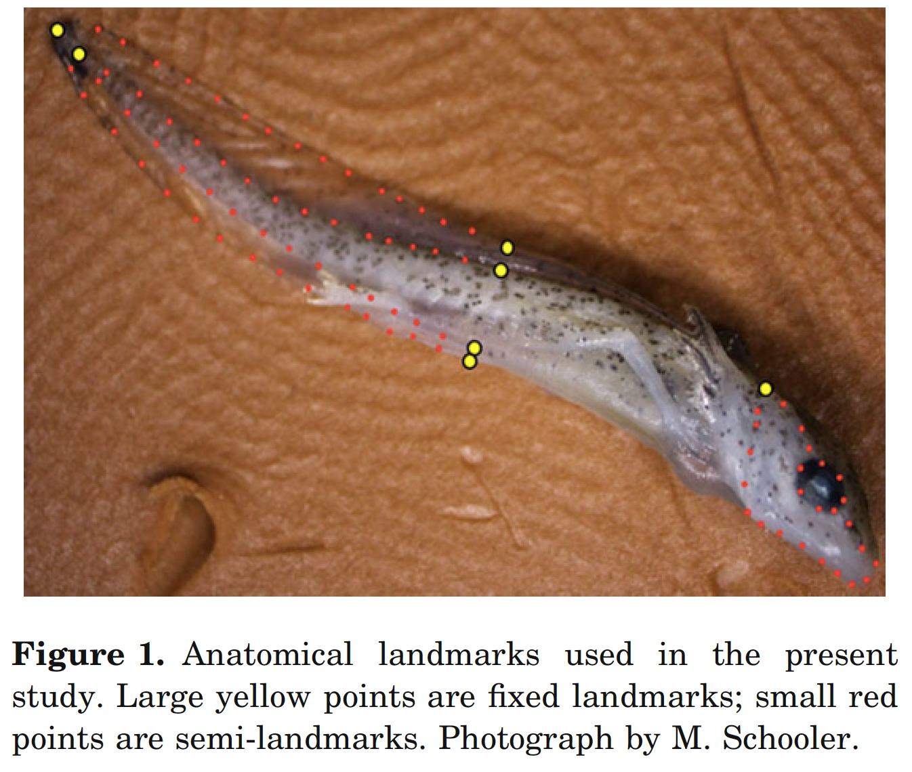

###### Levis et al. (2016) *Biological Journal of the Linnean Society*, 118(3),569–581.

# Imagine this scenario…

Produces a GPA result that looks like this:

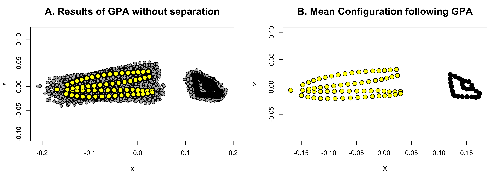

# Imagine this scenario…

But separate GPAs on heads and tails gives better results in terms of
variation around individual
landmarks\!

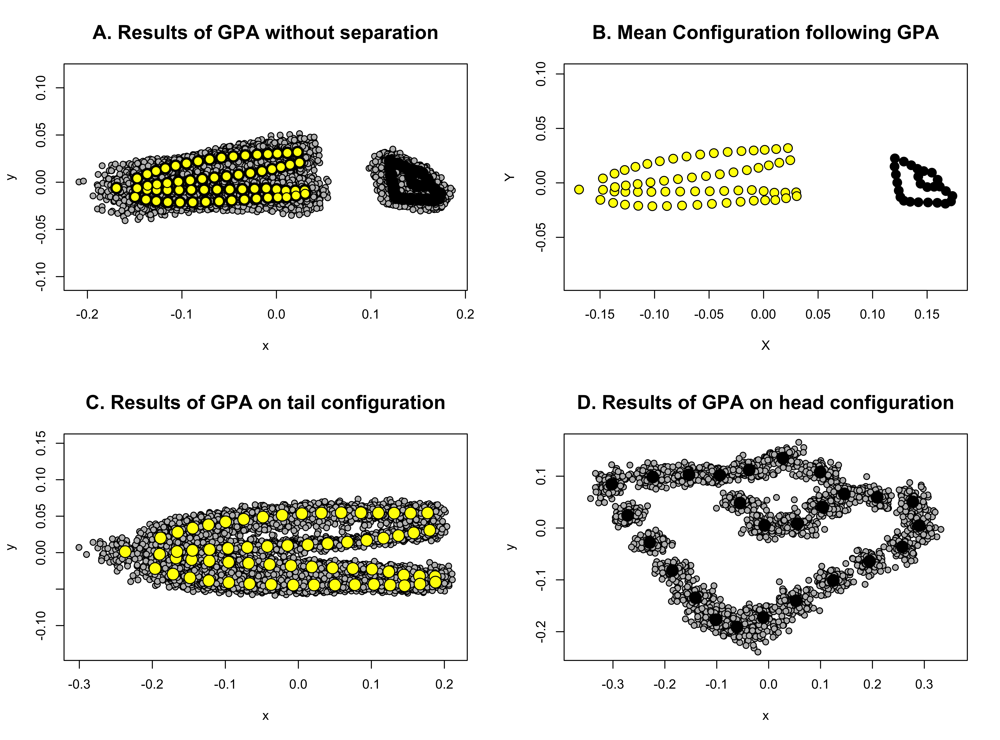

# Is there a way to combine Procrustes residuals from separate configurations for morphological analyses?

  - When one might wish to do this
  - How one might wish to do this
  - Should separate configurations be weighted in combination?
  - Should combined configurations be re-aligned with GPA?
  - The `combine.subsets` function in `geomorph`
  - Parting thoughts

# When one might wish to combine landmark configurations

  - Moving structures
      - **Articulated**
      - Non-articulated

Adams (1999) introduced methods for (1) fixing the articulation angle
(2D configurations) between separate configurations or (2) appending
subsets of data. Vidal-García et al. (2018) extended the fixed-angle
concept to 3D data (multiple points and planar
rotations).

###### Adams (1999) Evolutionary Ecology Research, 1, 959–970; Vidal-García et al. (2018) Ecology and Evolution, 8(9), 4669-4675.

# When one might wish to combine landmark configurations

  - Moving structures
      - Articulated
      - **Non-articulated**

Non-articulated structures can be combined with the “separate subsets”
method (Adams 1999). When combined, configurations should be scaled to
relative sizes (GPA will render all configurations to unit size).

Davis et al. (2016) offered a simple way to do that with this equation:

\[CS^{'}_i=\frac{CS_{i}}{\sum_{i=1}^{g}CS_{i}},\]

where \(CS^{'}_i\) is the *relative centroid size* of configuration
\(i\), which is a scalar multiplied by the coordinates when appending
configurations. If one configuration is large and one is small, they
will remain large and small in combination. (This is done per specimen.)

Note that combined configurations are not actually unit size, as Davis
et al. (2016) suggested, but are consistently scaled across
specimens.

###### Adams (1999) Evolutionary Ecology Research, 1, 959–970; Davis et al. (2016) PLoS ONE, 11(1), e0211753.

# When one might wish to combine landmark configurations

  - Moving structures
      - Articulated
      - Non-articulated
      - **Multiple planar views of a 3D object** (Davis et al. 2016;
        Profico et al. 2020)

Profico et al. (2020) demonstrated that by combining multiple 2D
configurations, it was possible to produce similar PC dispersion
patterns to 3D configurations, which might be beneficial if 3D data
collection is not easy or possible.

They also found issues with the Davis et al. (2016) approach and offered
a new solution for relativizing centroid sizes (more details
soon).

###### Davis et al. (2016) PLoS ONE, 11(1), e0211753; Profico et al. (2020) Hystrix,the Italian Journal of Mammalogy, 30, 157–165.

# How one should combine landmark configurations

Collyer et al. (2020) proposed a general formula for obtaining relative
centroid
sizes

\[CS^{'}_i=\frac{w_iCS_{i}}{\sqrt{\sum_{i=1}^{g} \left(w_iCS_{i}\right)^2}},\]

where the denominator is the *pooled centroid size* from multiple
configurations and \(w_i\) are *a priori* weights. Relative centroid
sizes are then used to scale Procrustes residuals, \(\mathbf{Z}_i\),
i.e.,

\[\mathbf{Z} = \begin{pmatrix}
CS^{'}_1\mathbf{Z}_1\\
CS^{'}_2\mathbf{Z}_2\\
\vdots\\
CS^{'}_g\mathbf{Z}_g\\
\end{pmatrix}.\]

\(\mathbf{Z}\) is a matrix of combined coordinates, centered at \(0,0\)
(2D) or \(0,0,0\) (3D) with a (pooled) centroid size equal to \(1\).

If all \(w_i\) are equal (to \(1\)), we can call this relative centroid
sizes via **standard** centroid size (\(SCS\)).

If \(w_i\) are not all equal, we can call this relative centroid sizes
via **weighted** centroid size.

###### Collyer et al. (2020) Evolutionary Biology, *in press*.

# How one should combine landmark configurations

Collyer et al. (2020) proposed a general formula for obtaining relative
centroid
sizes

\[CS^{'}_i=\frac{w_iCS_{i}}{\sqrt{\sum_{i=1}^{g} \left(w_iCS_{i}\right)^2}},\]

Profico et al. (2020) found the unweighted approach of Davis et al.
(2016) – and by extension, when all \(w_i\) above are equal – had some
flaws and offered a solution that

\[w_i = \left(p_{i}k \right)^{-1/2},\]

for the \(p\) landmarks in \(k\) dimensions. (\(k\) is not needed for
comparing multiple centroid sizes in the same dimension.) These weights
*normalize* centroid size (Dryden and Mardia 2016). ***Whereas centroid
size finds the sum of squared distances of landmarks to their centroid,
normalized centroid size finds the mean of squared
distances.***

###### Collyer et al. (2020) Evolutionary Biology, *in press*; Profico et al. (2020) Hystrix,the Italian Journal of Mammalogy, 30, 157–165; Dryden & Mardia (2016). *Statistical shape analysis: With applications in R*. Wiley.

# How one should combine landmark configurations

Collyer et al. (2020) proposed a general formula for obtaining relative
centroid
sizes

\[CS^{'}_i=\frac{w_iCS_{i}}{\sqrt{\sum_{i=1}^{g} \left(w_iCS_{i}\right)^2}},\]

  - Normalized centroid size might have comparative appeal, if one
    wishes to compare (*or combine*) sparse and dense configurations,
    especially if structures are not so disparate in size.
  - Normalized centroid size might be more consistent with “anatomical
    size”.
  - Note Profico et al. (2020) only used the numerator above as a
    solution, so relative centroid size does not range between 0 and 1,
    and combined configurations would be neither unit size nor
    consistent in size following combination.
  - **However, using the formula above, relative centroid size via
    standard centroid size (\(SCS\)) or via normalized centroid size
    (\(NCS\)) must range between 0 and 1 and will produce combined
    configurations, \(\mathbf{Z}\), with unit
size.**

###### Collyer et al. (2020) Evolutionary Biology, *in press*; Profico et al. (2020) Hystrix,the Italian Journal of Mammalogy, 30, 157–165.

# Why normalize centroid size to find relative sizes of configurations?

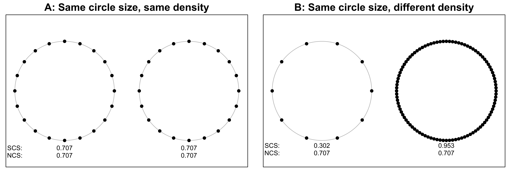

As Profico et al. (2020) illustrated, circles with the same radius and
surface area have different \(CS^{'}\) when using \(SCS\) but not when
using \(NCS\) to relativize.

#### Notes

  - \(\sqrt{0.707^2 + 0.707^2} = 1\) and
    \(\sqrt{0.302^2 + 0.953^2} = 1\)
  - The configurations are not circles. They are *isocagons*, a
    *decagon*, and a
*hectogon*.

###### Profico et al. (2020) Hystrix,the Italian Journal of Mammalogy, 30, 157–165.

# Why normalize centroid size to find relative sizes of configurations?


#### This gives the impression that \(CS^{'}\) via \(NCS\) is independent of landmark density.

  - Not so fast… more to come in a
moment.

#### What about circles of different size?

#### What about configurations with interior and exterior landmarks (concentric circles)?

# Why normalize centroid size to find relative sizes of configurations?

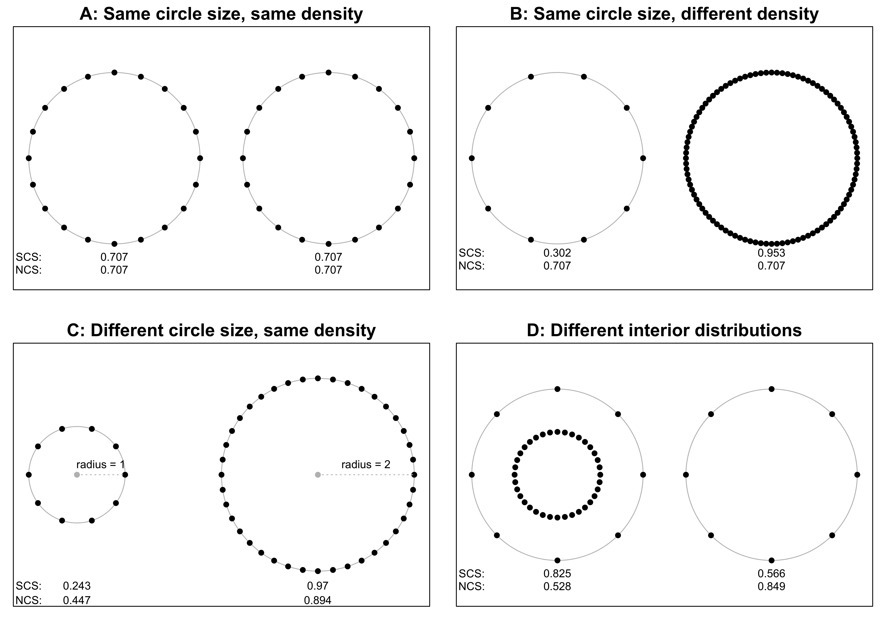

# Why normalize centroid size to find relative sizes of configurations?

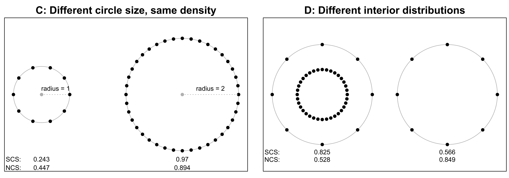

#### Notes

  - When doubling the radius, \(CS^{'}\) via \(NCS\) is doubled. **Does
    this make sense?**
      - When doubling the radius of a circle, the surface area increases
        \(4 \times\) (volume of a sphere would increase \(8 \times\)).
        Note that \(CS^{'}\) via \(SCS\) increases \(4 \times\).  
  - When adding an interior circle of landmarks \(CS^{'}\) via \(NCS\)
    was smaller despite equal “anatomical size”. **Does this make
    sense?**
      - \(CS^{'}\) via \(SCS\) was larger, as it has to be by summing
        squared distances rather than averaging
them.

# Normalizing centroid size is not a universal solution

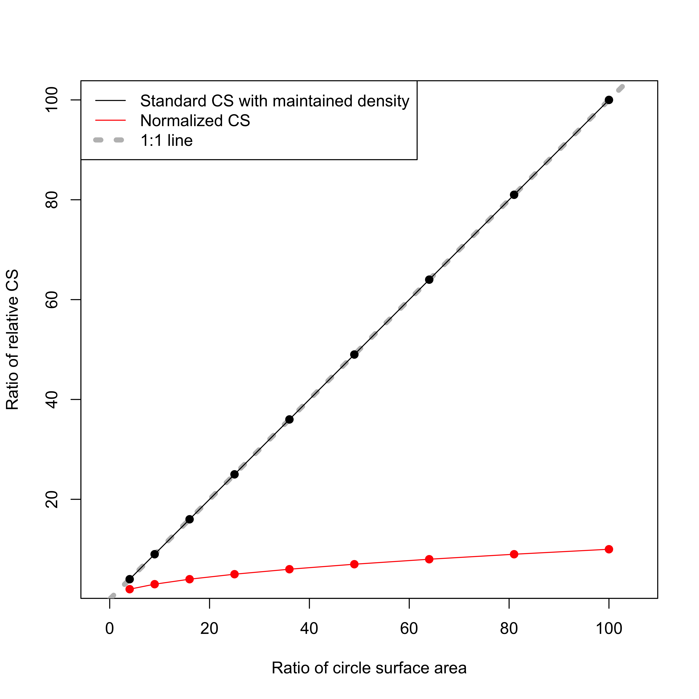

### I.e., \(NCS\) will tend to make smaller objects larger in relative size, if landmark density is the same.

# Normalizing centroid size is not a universal solution

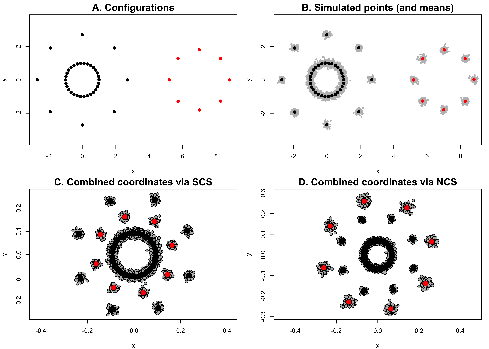

### I.e., \(NCS\) is landmark density-dependent and seems only viable when comparing uniform landmark distributions on the exterior of objects.

We discuss non-uniformly distributed landmark distributions in Collyer
et al. (2020), which only exacerbate issues.

###### Collyer et al. (2020) Evolutionary Biology, *in press*

# Normalizing centroid size is not a universal solution

Empirical example

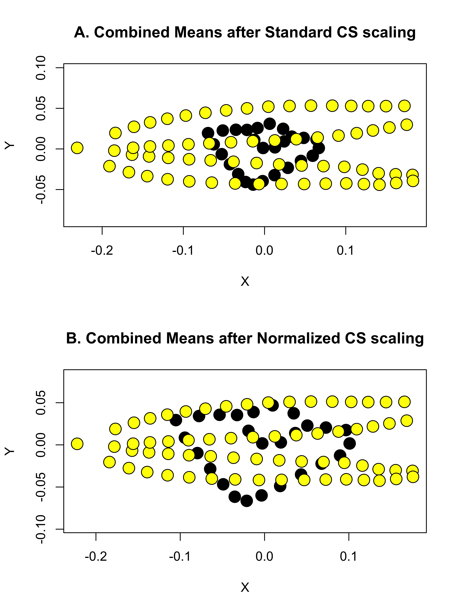

As a reminder


# Normalizing centroid size is not a universal solution

## To summarize (thus far)

  - \(NCS\) cannot be viewed as a universal solution
  - There probably isn’t a universal
    solution.  
  - \(CS^{'}_i=\frac{w_iCS_{i}}{\sqrt{\sum_{i=1}^{g} \left(w_iCS_{i}\right)^2}}\)
    means multiple solutions can be envisioned, including trial and
    error.

## To emphasize

  - \(CS\) is not “anatomical size”
  - Only \(SCS\) can preserve rank order of configuration (not
    anatomical) sizes
  - Only \(CS\) is uncorrelated with shape in the absence of allometry
  - \(CS\) is important for **GPA** to obtain shape variables
  - Disparate landmark densities should be viewed as a digitizing
    problem rather than a statistical problem
  - Regarding statistical applications, \(NCS\) or any other weighting
    strategy carries the same considerations any weighted least-squares
    approach
would

# Should combined configurations be considered shapes? Should they be aligned?

\[\mathbf{Z} = \begin{pmatrix}
CS^{'}_1\mathbf{Z}_1\\
CS^{'}_2\mathbf{Z}_2\\
\vdots\\
CS^{'}_g\mathbf{Z}_g\\
\end{pmatrix}.\]

\(\mathbf{Z}\) is a matrix of combined coordinates, centered at \(0,0\)
(2D) or \(0,0,0\) (3D) with a (pooled) centroid size equal to \(1\).

This sounds a lot like \(\mathbf{Z}\) is a new set of Procrustes
residuals.

  - Does this mean that there is a “shape space” for combined
    configurations?  
  - Should we perform GPA on combined
configurations?

# Should combined configurations be considered shapes? Should they be aligned?

Collyer et al. (2020) goes into more detail, but the simple answer is
**No**.

Combining landmark configurations introduces landmark covariances that
have no anatomical meaning. (Even anatomically, if configurations
correspond to objects that can change with respect to spatial
relationships, like heads and tails, covariances between landmarks in
separate configurations do not make sense.)

Combined configurations are composites of shapes, perhaps integrated,
which might be used as morphological variables for statistical analyses.
But visualization of shape differences (e.g., TPS warp grids) should not
be performed on combined
configurations.

###### Collyer et al. (2020) Evolutionary Biology, *in press*

# Should combined configurations be considered shapes? Should they be aligned?

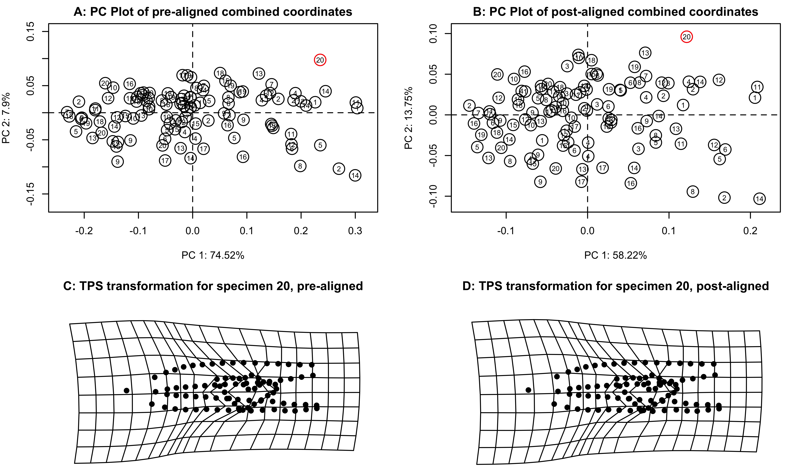

# Should combined configurations be considered shapes? Should they be aligned?

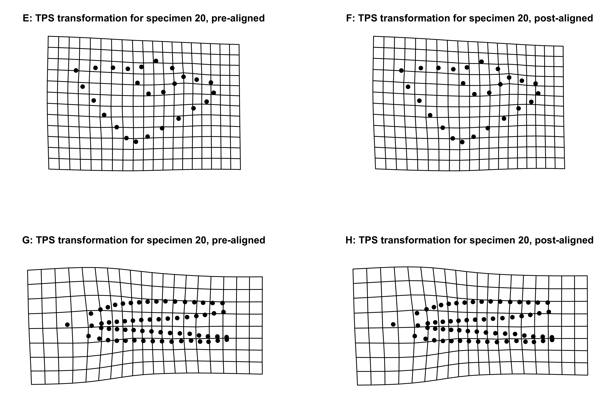

# Should combined configurations be considered shapes? Should they be aligned?

Collyer et al. (2020) goes into more detail, but the simple answer is
**No**.

Combining landmark configurations introduces landmark covariances that
have no anatomical meaning. (Even anatomically, if configurations
correspond to objects that can change with respect to spatial
relationships, like heads and tails, covariances between landmarks in
separate configurations do not make sense.)

Combined configurations are composites of shapes, perhaps integrated,
which might be used as morphological variables for statistical analyses.
But visualization of shape differences (e.g., TPS warp grids) should not
be performed on combined configurations. ***It is possible to map
multiple shape changes to one point in a combined PC plot.***

###### Collyer et al. (2020) Evolutionary Biology, *in press*

# An example in `geomorph`, using `combine.subsets`

``` r
library(geomorph)
```

    ## Loading required package: RRPP

    ## Loading required package: rgl

``` r
data(larvalMorph) 
attributes(larvalMorph)
```

    ## $names
    ## [1] "headcoords"   "tailcoords"   "head.sliders" "tail.sliders" "treatment"   
    ## [6] "family"

``` r
head.gpa <- gpagen(larvalMorph$headcoords, curves = larvalMorph$head.sliders,
print.progress = FALSE)
tail.gpa <- gpagen(larvalMorph$tailcoords, curves = larvalMorph$tail.sliders,
print.progress = FALSE)
```

#### Note we can make full organism coordinates and sliders, and perform GPA

``` r
sliders <- rbind(larvalMorph$head.sliders, 26 + larvalMorph$tail.sliders)

coords <- simplify2array(
  lapply(1:length(larvalMorph$treatment), function(j){
    rbind(larvalMorph$headcoords[,,j], larvalMorph$tailcoords[,,j])
  })
)

all.gpa <- gpagen(coords, curves = sliders, print.progress = FALSE)
```

# An example in `geomorph`, using `combine.subsets`

``` r
plot(all.gpa)
```

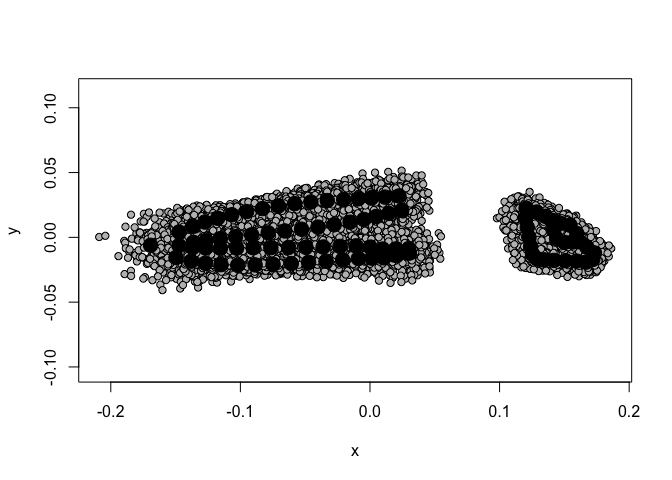<!-- -->

This should look familiar

# An example in `geomorph`, using `combine.subsets`

``` r
par(mfrow = c(1, 2))

plot(tail.gpa)
plot(head.gpa)
```

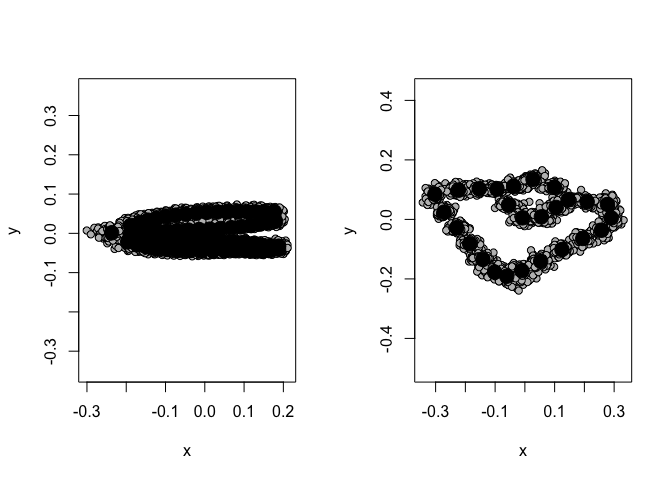<!-- -->

``` r
par(mfrow = c(1, 1))
```

This should look familiar

# An example in `geomorph`, using `combine.subsets`

## Combine with \(SCS\)

``` r
comb.lm <- combine.subsets(head = head.gpa, tail = tail.gpa, gpa = TRUE)
summary(comb.lm)
```

    ## 
    ## A total of 2 subsets were combined
    ## 
    ##                                  head       tail
    ## Number of points in subset 26.0000000 64.0000000
    ## Mean centroid size          5.7101870 24.2377131
    ## Mean relative size          0.1906707  0.8093293

``` r
par(mfrow = c(1,2))
plotAllSpecimens(comb.lm$coords)
plot(comb.lm$coords[,,1], pch = 21, bg = c(rep(1,26), rep(2,64)), asp = 1)
```

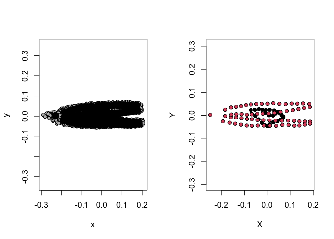<!-- -->

``` r
par(mfrow = c(1,2))
```

# An example in `geomorph`, using `combine.subsets`

## Combine with \(NCS\)

``` r
comb.lm <- combine.subsets(head = head.gpa, tail = tail.gpa, gpa = TRUE,
                           norm.CS = TRUE)
summary(comb.lm)
```

    ## 
    ## A total of 2 subsets were combined
    ## 
    ##                                  head       tail
    ## Number of points in subset 26.0000000 64.0000000
    ## Mean centroid size          1.1198598  3.0297141
    ## Mean relative size          0.2698734  0.7301266

``` r
par(mfrow = c(1,2))
plotAllSpecimens(comb.lm$coords)
plot(comb.lm$coords[,,1], pch = 21, bg = c(rep(1,26), rep(2,64)), asp = 1)
```

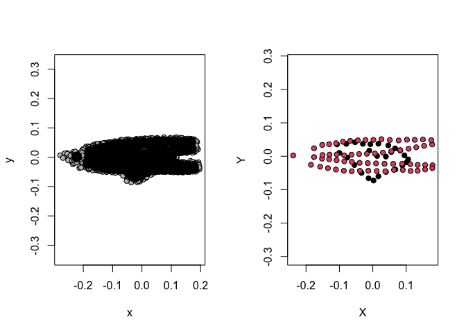<!-- -->

``` r
par(mfrow = c(1,2))
```

# An example in `geomorph`, using `combine.subsets`

## Combine with user-defined weights

``` r
comb.lm <- combine.subsets(head = head.gpa, 
tail = tail.gpa, gpa = TRUE, norm.CS = FALSE, weights = c(0.3, 0.7))
summary(comb.lm)
```

    ## 
    ## A total of 2 subsets were combined
    ## 
    ##                                   head      tail
    ## Number of points in subset 26.00000000 64.000000
    ## Mean centroid size          1.71305611 16.966399
    ## Mean relative size          0.09170803  0.908292

``` r
par(mfrow = c(1,2))
plotAllSpecimens(comb.lm$coords)
plot(comb.lm$coords[,,1], pch = 21, bg = c(rep(1,26), rep(2,64)), asp = 1)
```

<!-- -->

``` r
par(mfrow = c(1,1))
```

# An example in `geomorph`, using `combine.subsets`

## Ignore relativization, all together

``` r
comb.lm <- combine.subsets(head = head.gpa$coords, 
tail = tail.gpa$coords, gpa = FALSE, CS.sets = NULL)
```

    ## 
    ## No CS sets input.  Final configurations will not be scaled

``` r
par(mfrow = c(1,2))
plotAllSpecimens(comb.lm$coords)
plot(comb.lm$coords[,,1], pch = 21, bg = c(rep(1,26), rep(2,64)), asp = 1)
```

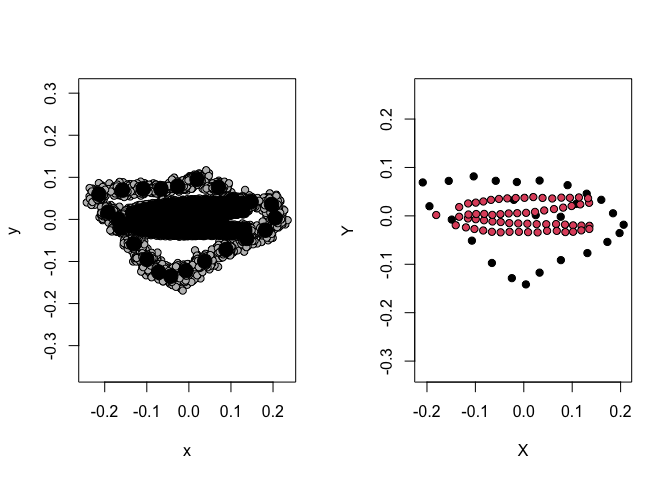<!-- -->

``` r
par(mfrow = c(1,1))
```

# More on `combine.subsets`

  - It can detect if objects are `gpagen` objects or coordinates that
    require `gpagen` be performed.
  - Observed and relative \(CS\), GPA coordinates, and adjusted GPA
    coordinates can all be extracted, in addition to combined
    coordinates.

# Parting Thoughts

  - There is no panacea for combining configurations.
      - \(SCS\) will relativize configurations according to summed
        squared distances of landmarks from their centroid, the number
        of landmarks, and distribution of landmarks
      - \(NCS\) will relativize configurations according to averaged
        squared distances on landmarks from their centroid, and
        distribution of landmarks.
      - Both are landmark density-dependent.
      - There will always be cases where one approach seems inferior.
  - ***But is having disparate landmark densities an analytical
    problem?***
      - Or is it a digitizing problem?
  - Could densities be augmented or culled?
  - If comparing the size of structures, \(CS\) is probably not the best
    size measure
  - If relativizing configurations, \(CS\) is a precise size for the
    shape characterized by the configuration.
  - Other weighting strategies could be envisioned. Trial and error for
    specific data sets might be the way to go.

# Acknowledgments

Collyer et al. 2020. Making Heads or Tails of Combined Landmark
Configurations in Geometric Morphometric Data. Evolutionary Biology, *In
Press*.

<https://www.researchgate.net/publication/341946958_Making_Heads_or_Tails_of_Combined_Landmark_Configurations_in_Geometric_Morphometric_Data>

Co-authors: Mark Davis · Dean Adams

Funding: NSF Grants DEB-1737895 and DBI-1902694 (to MC) and DEB-1556379
and DBI-1902511 (to DA)
