## Outline for tutorial
- Objectives of the tutorial
- Where do we see projections (regressions, PCA, discriminant analysis, allometry shape scores, selection differentials, ...)
- A review of some linear algebra that we need to use
  - norm of a vector (and a use for it and an example)
  - Distance between two vectors as the norm of the difference vector.
  - Vector Correlations (angle between vectors) and the vector dot product.
  - Projections of one vector onto another
- scalar projections VS. vector projections.
- simple linear regression as a projection (slope)
- Projections onto a difference vector, example for sexual shape dimorphism.
- Common uses of projections in GMM: PCA
- Common uses of projections: allometry shape scores
- Common use of projections, discriminant functions as a scaled version of the difference vector.
- Discuss: Can you use discriminant functions in GMM?
- Discuss: Common uses of projections: projecting onto PCA of fitted values.
- Discuss:Back transformations
- Discuss: Regularization
  
## Learning Objectives of the tutorial
- By the end of this tutorial you will be able to:
- Recognize common situations where projections are used in geometric morphometrics (and statistics).
- Use basic linear algebra to calculate useful quantities in morphometrics like magnitudes, distance, vector correlations and projections.
- See how to compute a projection of interest to your research.
- Understand some of the limitations of the use of vector projections.

## Example for today - pupfish redux

- We will use the pupfish example from geomorph supplemented with other examples.
- It may not actually be the best data for all the examples I am illustrating, but it means not having to load in any other data!

- Please note that the examples I am doing are more for illustrative purposes, and not as an exact analysis guide. 

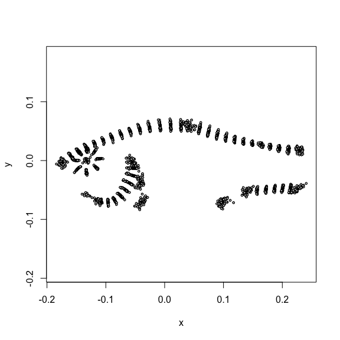<!-- -->

- examining centroid size and shape across sex (sexual dimorphism) and two populations.

## Some housekeeping we will need to do for the data


```r
pupfish_dat <- with(pupfish, data.frame(CS, Pop, Sex))

pupfish_dat$PopSex <- with(pupfish_dat, 
    interaction(Pop, Sex, drop = TRUE))

# adding to shape data
Pupfish$logCS <- log(Pupfish$CS)

Pupfish$logCS_c <- Pupfish$logCS - mean(Pupfish$logCS) # mean centering is often good practice. Won't notice much here, but can help with some plots. 
```

## You use projections all of the time already!
- linear regression is just a projection
- When we plot principal components, or allometry shape scores you are using a projection!
- So we just need to think about how they work.


## Reviewing some of the fundamentals: magnitude of a vector
- Let's say I want to assess how "big" the influence of size is on shape (i.e. allometry). After we fit the model, we get an allometry vector ($\bf{a}$). But how "big" is this value? 
- We want the *magnitude* of this vector.
- The *magnitude* of a vector (also known as the *length* or *L2 norm*) is our most basic quantity in linear algebra.
- It is also super easy to calculate!

## Reviewing some of the fundamentals: magnitude of a vector
 Our allometry vector ($\mathbf{a}$) (with p being the total number of x,y coordinates)

\[
 \mathbf{a}= \begin{bmatrix} a_1\\a_2\\a_3\\\vdots\\a_p\end{bmatrix}
 \]
 
- All we need to is sum up the squared values of each value and then take the square root.

  \[
  \sqrt{ \sum\limits_{i = 1}^{p} a_i^2}
 \]

- In R: 

```r
magnitude = function(x) {sqrt(sum(x^2))}
a = c(1, -0.5, 3, 0.2, -0.1) # a random vector to play with
magnitude(a)
```

```
## [1] 3.21
```

## Reviewing some of the fundamentals: magnitude of a vector
 We can do write this using the vector dot product like so
 
 \[
||\mathbf{a}|| = \sqrt{ \mathbf{a}' \mathbf{a}}  = \sqrt{\mathbf{a} \cdot \mathbf{a}}
\]

 where $\mathbf{a}'$ is the vector transpose (row vector) of $\mathbf{a}$
 
\[
\mathbf{a}' \mathbf{a}= a_1^2 + a_2^2 +  \cdots + a_p^2 
\]

- in R:

```r
magnitude_v2 = function(x) { sqrt(x %*% x)}

a = c(1, -0.5, 3, 0.2, -0.1) # a random vector to play with
magnitude_v2(a)
```

```
##      [,1]
## [1,] 3.21
```

```r
# or use norm()
norm(a, type = "2")
```

```
## [1] 3.21
```
 
## Reviewing some of the fundamentals: magnitude of a vector
- It is worth remembering that the length of the vector represents the *distance* from the origin to the point $\mathbf{a}$

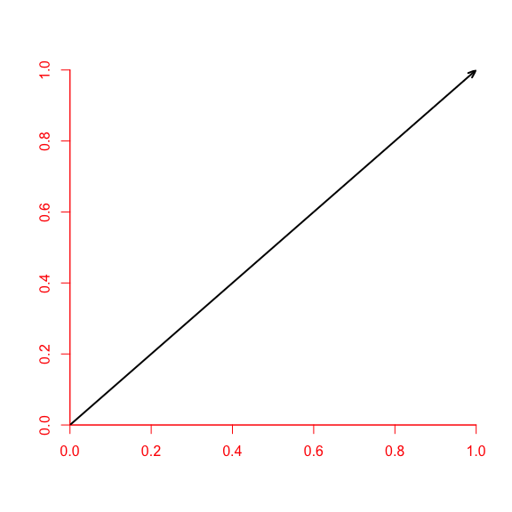<!-- -->


## How is this useful to me?

- Way back when we considered using pairwise, you may remember some output.

- Consider these two models (one with different allometries per group, one with common allometries)


```r
mod_shape_wAllometry_Full <- procD.lm(coords ~  logCS_c*Pop*Sex,  
                         data = Pupfish, 
                         SS.type = "II",
                         print.progress = FALSE,  
                         iter = 9) # note number of iterations!!!

mod_shape_commonAllometry <- procD.lm(coords ~ logCS_c + Pop*Sex,  
                         data = Pupfish, 
                         SS.type = "II",
                         print.progress = FALSE,  
                         iter = 9)
```

## The magnitude of vectors 

- We looked at some properties of each allometry vector, like vector correlations (back to this in a bit) but also magnitude!


```r
shape_pairwise_interaction_allometry_final <- pairwise(fit =    
    mod_shape_wAllometry_Full,
    fit.null = mod_shape_commonAllometry, 
    covariate = Pupfish$logCS_c, # the covariate
    groups = pupfish_dat$PopSex )

summary.pairwise(shape_pairwise_interaction_allometry_final, 
                 test.type = "dist", show.vectors = F) 
```

```
## 
## Pairwise comparisons
## 
## Groups: Marsh.F Sinkhole.F Marsh.M Sinkhole.M 
## 
## RRPP: 10 permutations
## 
## Slopes (vectors of variate change per one unit of covariate change, by group):
## Vectors hidden (use show.vectors = TRUE to view)
## 
## Slope vector lengths
##    Marsh.F Sinkhole.F    Marsh.M Sinkhole.M 
##     0.0985     0.0805     0.0890     0.1301 
## 
## Pairwise absolute difference (d) between vector lengths, plus statistics
##                             d UCL (95%)      Z Pr > d
## Marsh.F:Sinkhole.F    0.01798    0.0509 -0.323    0.5
## Marsh.F:Marsh.M       0.00947    0.0752 -0.800    0.9
## Marsh.F:Sinkhole.M    0.03159    0.0540  0.474    0.3
## Sinkhole.F:Marsh.M    0.00851    0.0582 -0.619    0.8
## Sinkhole.F:Sinkhole.M 0.04957    0.0414  2.148    0.1
## Marsh.M:Sinkhole.M    0.04106    0.0787  0.295    0.3
```


## Now you can do this by yourself!

Now you can do this yourself!

```r
allometry_vectors = shape_pairwise_interaction_allometry_final$slopes[[1]] 
# pulling out allometry vectors for observed

# doing it for each row of the coefficients
apply(allometry_vectors, MARGIN = 1,
      function (x) norm(x, type = "2"))
```

```
##    Marsh.F Sinkhole.F    Marsh.M Sinkhole.M 
##     0.0985     0.0805     0.0890     0.1301
```

## Distance between two vectors (and difference/contrast vectors)
- Sometimes we want to calculate the distance between two vectors.
  - Say we want to look at the distance between mean shape for males and females in the *Marsh*.
- As with everything I am doing, I am assuming we want to consider the Euclidian distance (since we are pretending to be in a Euclidean world)


```r
mod_shape_II <- procD.lm(coords ~ 1 + Pop + Sex + Pop:Sex, 
                         data = Pupfish, 
                         SS.type = "II",
                         print.progress = FALSE,  
                         iter = 9)

mod_shape_reduced2 <- procD.lm(coords ~ 1 + Pop + Sex, 
                         data = Pupfish, 
                         print.progress = FALSE,  
                         iter = 9)

shape_pairwise_interaction <- pairwise(fit = mod_shape_II, 
                                       fit.null = mod_shape_reduced2,
                                       groups = pupfish_dat$PopSex)

summary.pairwise(shape_pairwise_interaction, test.type = "dist") 
```

```
## 
## Pairwise comparisons
## 
## Groups: Marsh.F Sinkhole.F Marsh.M Sinkhole.M 
## 
## RRPP: 10 permutations
## 
## LS means:
## Vectors hidden (use show.vectors = TRUE to view)
## 
## Pairwise distances between means, plus statistics
##                            d UCL (95%)       Z Pr > d
## Marsh.F:Sinkhole.F    0.0330    0.0326  1.1900    0.1
## Marsh.F:Marsh.M       0.0461    0.0443  1.7021    0.1
## Marsh.F:Sinkhole.M    0.0388    0.0451 -0.6015    0.7
## Sinkhole.F:Marsh.M    0.0461    0.0492  0.0592    0.7
## Sinkhole.F:Sinkhole.M 0.0257    0.0395 -1.7349    1.0
## Marsh.M:Sinkhole.M    0.0280    0.0320 -0.0906    0.6
```

## How do we compute these distances ourselves?

```r
# pulling out the estimated values (must be an easier way)
shape_means <- shape_pairwise_interaction$LS.means[[1]]

# and compute the distance between the mean shape vector for males and females
dist(shape_means[c(1,3),], 
     method = "euclidian")
```

```
##         Marsh.F
## Marsh.M  0.0461
```

- But what is this really doing?  

## Euclidian distance is just the magnitude of the difference between vectors.
- All we are  doing is subtracting one vector from the other to compute the *contrast vector* (difference vectors).


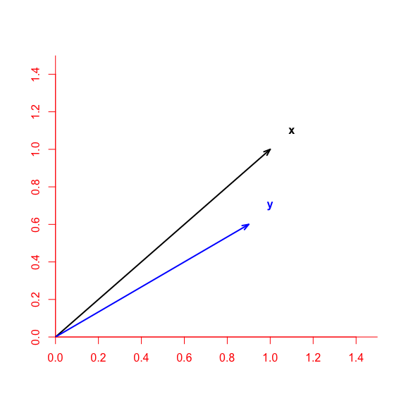<!-- -->

## Euclidian distance is just the magnitude of the difference between vectors.
- All we are really doing is subtracting one vector from the other to compute the *contrast vector* (difference vectors).

 \[
||\mathbf{x} - \mathbf{y}|| = \sqrt{(x_1 - y_1)^2 + (x_2 - y_2)^2 +  \cdots + (x_p - y_p)^2}
\]

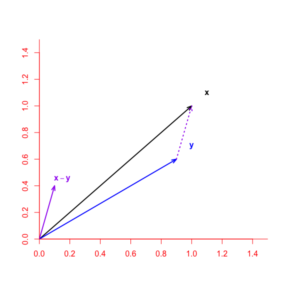<!-- -->

## Euclidian distance is just the magnitude of the difference between vectors.
- All we are doing is subtracting one vector from the other to compute the *contrast vector* (difference vectors).

- For our shape vectors in R we could do this:


```r
sex_difference_marsh <- shape_means[1,] - shape_means[3,]

# the function we wrote above
magnitude(sex_difference_marsh)
```

```
## [1] 0.0461
```

```r
magnitude_v2(sex_difference_marsh)
```

```
##        [,1]
## [1,] 0.0461
```

```r
#built-in
norm(sex_difference_marsh, type = "2")
```

```
## [1] 0.0461
```


## Treatment contrasts can sometimes make it easier.
- By default `R` using treatment contrasts coding. So we could actually save some time using the coefficients from the full model.


```r
mod_shape_II$coefficients[,1:4]
```

```
##                      [,1]      [,2]     [,3]     [,4]
## (Intercept)      -0.03629 -0.067944 -0.03906 -0.03714
## PopSinkhole      -0.00103  0.001498 -0.00181  0.00636
## SexM             -0.00795 -0.006809 -0.00465 -0.00556
## PopSinkhole:SexM  0.00465 -0.000242  0.00278 -0.00106
```

- I am displaying only a few of the coefficients associated with each landmark (the first two landmarks).

- The "intercept" is really the mean shape for females in the Marsh.


```r
levels(Pupfish$Sex)
```

```
## [1] "F" "M"
```

```r
levels(Pupfish$Pop)
```

```
## [1] "Marsh"    "Sinkhole"
```

- but you see that `sexM` row? **That** is the treatment contrast vector for males from the Marsh population. In other words, the difference vector between Marsh males and females. 

- So we can just use:

```r
norm(mod_shape_II$coefficients[3,], type = "2")
```

```
## [1] 0.0461
```


## Normalizing (scaling a vector)
- You may have noticed that the vectors in the picture differed in two properties, direction and length. Sometimes we want to focus on one or the other.

- A vector whose length is $1$ is said to be *normalized* or a *unit* vector. In biology or statistics we may think about this as scaling a vector to a common length.

\[
\hat{\mathbf{a}} = \frac{\mathbf{a}}{||\mathbf{a}||} 
\]

- Please note: I don't suggest using the hat notation $\hat{\mathbf{a}}$ to be unit vectors. While useful in math, in statistics we use it to mean estimated values!

- Why might we want to scale such a vector?

## Comparing directions of vectors (vector correlations or angles)

- So if we rescale our vectors (as above), we can focus on direction only.
- Turns out this can be done using the dot product of the two vectors!

\[
 r = \frac{\mathbf{x} \cdot \mathbf{y}}{||\mathbf{x}|| \times ||\mathbf{y}||} 
\]


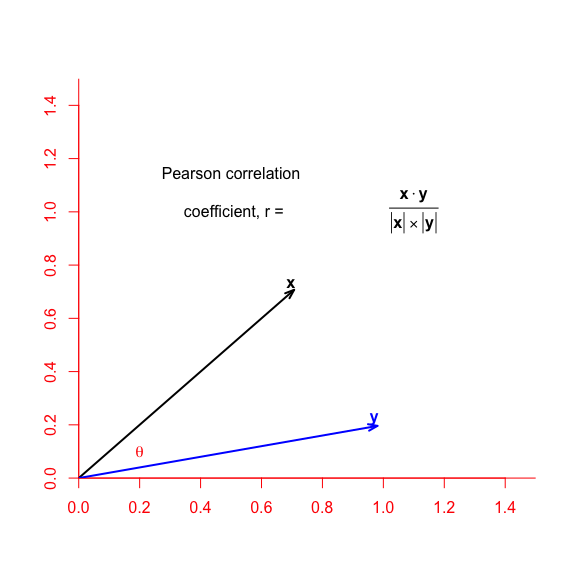<!-- -->


## Comparing directions as angles

- Some people prefer thinking about angles between vectors (instead of correlations)
- Our $r$ is equal to $\cos \theta$, where $\theta$ is the angle we want.

\[
 \cos \theta = \frac{\mathbf{x} \cdot \mathbf{y}}{||\mathbf{x}|| \times ||\mathbf{y}||} 
\]

- So we use the `acos(r)` function to compute $\cos^{-1} r$ in radians.
  - If you want it in degrees multiply the value by $\frac{180}{\pi}$

## Comparing directions of vectors - r code.

We could write the code something like this


```r
angVecAbs <- function(vec1, vec2){
	vec1 <- vec1 - mean(vec1) 
	# Centering vector to enable comparison to Pearson Corr
	vec2 <- vec2 - mean(vec2) 
	# Centering vector to enable comparison to Pearson Corr
	
	vec.cor <- abs((t(vec1) %*% vec2)/(magnitude(vec1)*magnitude(vec2)))
	vec.angle <- acos(vec.cor)*(180/pi) # degrees
	return(c(vector.cor = vec.cor, vec.angle = vec.angle))}

comment(angVecAbs) <- c(" This computes both the vector correlation, and angle, between two vectors.", " to compare to the Pearson correlation coefficient make sure to center", "set it up to compute the absolute values of the vector correlation")
```

## Comparing directions of sexual shape dimorphism vectors


```r
sex_difference_hole <- shape_means[2,] - shape_means[4,]

angVecAbs(sex_difference_hole, sex_difference_marsh)
```

```
## vector.cor  vec.angle 
##      0.739     42.322
```


## When I say "correlation" I really mean it!

- While it is not a "fast" function, we can actually just use the `cor` function directly.

```r
cor(sex_difference_hole, sex_difference_marsh)
```

```
## [1] 0.739
```

```r
angVecAbs(sex_difference_hole, sex_difference_marsh)
```

```
## vector.cor  vec.angle 
##      0.739     42.322
```

- note. the function actually doing the correlation IS fast, just not a call to `cor()`

- Note for ID to MC and DA. just confirming that for pairwise VC, default is radians not degrees?

## Now you have a bunch of tools!
- Well you always had most of these, as they are available in a number of R libraries including `geomorph`, `Morpho`, `evolqg` (among others). 
- Wish these nice libraries existed 15 years ago!
- Still it is nice to see how to do it.
- It also paves the way to understanding the algebra for projections.
  - Indeed we have already pretty much done it all!
  
## Shining a light down, and looking at a shadow.
- Take an object like a pen and hold it under an overhead light, close to your desk and let it cast a shadow on your desk.
- Looking only at the shadow, can you tell what it is?
  - Make the pen parallel to the desk (hopefully with the light directly above). What can you say about the length of the shadow?
  - Change the angle between the pen and the light source and keep looking at the shadow. What happens.
  - Make the pen perpendicular to the desk. Now what can you see? 
  
## Congratulations you are an expert at projections!
- You have now successfully projected an object onto the plane defined by your desk. 
- That is exactly what we are trying to achieve with projections in statistics and GMM as we will see.

## What are projections
- We use projections to ask the question "how much of my focal vector $\mathbf{x}$ is pointed in the direction that I am interested in $\mathbf{y}$?

- the projection of $\mathbf{x}$ on $\mathbf{y}$ tells us how much of our vector $\mathbf{x}$ is pointed in the direction of vector $\mathbf{y}$.

- We want a measure where if they are pointed in exactly the same direction (i.e. a vector correlation of 1) we would recover the length of $\mathbf{x}$.
- Likewise we want something that will have a length of $0$ when our two vectors are perpendicular (orthogonal).

## What are projections - visual aid


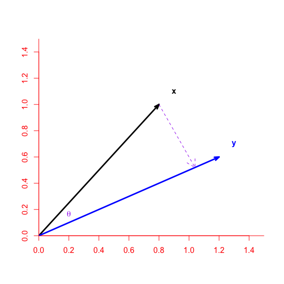<!-- -->


## Projections algebraically

- So we are using a vector that is orthogonal to $\mathbf{y}$ and shining it on $\mathbf{x}$.
- Scalar projection: If we just want the magnitude (length) of this projection we calculate it as:


\[
 || proj_{\mathbf{y}} \mathbf{x} || = \frac{\mathbf{x} \cdot \mathbf{y}}{ ||\mathbf{y}||} 
\]

- this scalar (single number)  is the length of the shadow for $\mathbf{x}$ has on $\mathbf{y}$.
- It is read as "projection of x on y"
- It can also be expressed with regards to the angle (not shown). [Here](https://mathinsight.org/dot_product) is a nice tutorial that allows you to play a bit.

## Sometimes we want the actual projection vector.
- What if we want the actual projection vector pointing in the direction of $\mathbf{y}$.
- We consider this in terms of the unit vector of $\mathbf{y}$. Recall:

\[
 \hat{\mathbf{y}} = \frac{\mathbf{y}}{ ||\mathbf{y}||} 
\]

- We just multiply the scalar value we calculated above to $\hat{\mathbf{y}}$
\[
  proj_{\mathbf{y}} \mathbf{x}  = 
      \frac{\mathbf{x} \cdot \mathbf{y}}{ ||\mathbf{y}||} 
      \times 
      \frac{\mathbf{y}}{ ||\mathbf{y}||}
\]

- Or more succiciently:
\[
  proj_{\mathbf{y}} \mathbf{x}  = 
      \frac{\mathbf{x} \cdot \mathbf{y}}{ ||\mathbf{y}||^2} 
      \mathbf{y}
\]

## Computing the scalar projection in R

- While this is not a general purpose function (just wait a few slides), we could write a function like this to test.

```r
projFunction <- function(x, y) {
  scalarProj <- (x %*% y) / norm(y, type = "2")
  return(scalarProj)
}
```

## Simple Linear regression as a projection.
- Just like we have seen the linear algrebra equivalent to a correlation coefficient, we can use a projection to get our estimates.
- Let's make up an example where we are looking at average size of a fly wing in relation to nutrition provided during development.


```r
nutrition <- rep(1:20, each = 5) # number of grams of protein in the food

size <- rnorm(length(nutrition), 
              mean = (2 + 0.5 * nutrition), 
              sd = 2)
plot(size ~ nutrition, pch = 20, col = "blue")
```

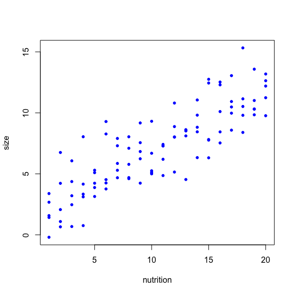<!-- -->

## Simple Linear regression as a projection.

- Obviously we would generally just use `lm()`


```r
print(lm(size ~ nutrition))
```

```
## 
## Call:
## lm(formula = size ~ nutrition)
## 
## Coefficients:
## (Intercept)    nutrition  
##       1.971        0.493
```

- But you could also do this with a projection!


```r
size_c <- size - mean(size) # centering our variables to keep it clean
nutrition_c <- nutrition - mean(nutrition)

(size_c %*% nutrition_c) / (norm(nutrition_c, type = "2"))^2
```

```
##       [,1]
## [1,] 0.493
```

- The astute among you may have noticed that we are using the magnitude squared of our predictor. This is because we scale the covariance between our two variables by the variance of the predictor.


```r
cov(size_c, nutrition_c)/ var(nutrition_c)
```

```
## [1] 0.493
```


## Projections for the interesting stuff.
- Let's consider the most common projection we use in morphometrics, namely principal components analysis.

- In geomorph

```r
PCA_gm <- gm.prcomp(pupfish$coords)
plot(PCA_gm, pch = 20)
```

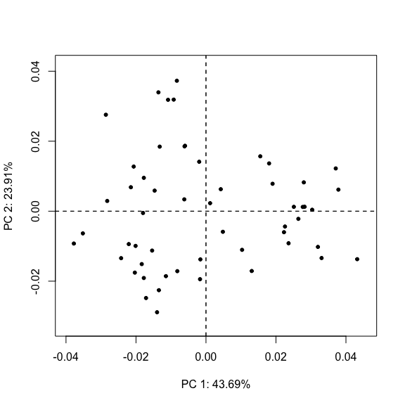<!-- -->

## PCA
- Let's work with the standard PCA function `prcomp` so I have an easier time remembering the name of things.


```r
pupfish_pca <- prcomp(Pupfish$coords, retx = T)

summary(pupfish_pca)
```

```
## Importance of components:
##                           PC1    PC2    PC3     PC4     PC5     PC6     PC7
## Standard deviation     0.0216 0.0159 0.0085 0.00741 0.00701 0.00578 0.00477
## Proportion of Variance 0.4369 0.2391 0.0680 0.05165 0.04622 0.03142 0.02138
## Cumulative Proportion  0.4369 0.6760 0.7440 0.79566 0.84188 0.87330 0.89469
##                            PC8     PC9    PC10    PC11    PC12    PC13    PC14
## Standard deviation     0.00433 0.00357 0.00301 0.00298 0.00289 0.00253 0.00241
## Proportion of Variance 0.01763 0.01201 0.00855 0.00835 0.00787 0.00602 0.00546
## Cumulative Proportion  0.91232 0.92433 0.93288 0.94123 0.94910 0.95513 0.96059
##                           PC15    PC16    PC17    PC18    PC19    PC20    PC21
## Standard deviation     0.00227 0.00215 0.00199 0.00183 0.00172 0.00165 0.00157
## Proportion of Variance 0.00487 0.00436 0.00373 0.00314 0.00277 0.00257 0.00231
## Cumulative Proportion  0.96546 0.96982 0.97355 0.97669 0.97946 0.98203 0.98434
##                           PC22    PC23    PC24    PC25    PC26    PC27     PC28
## Standard deviation     0.00142 0.00141 0.00118 0.00111 0.00101 0.00100 0.000974
## Proportion of Variance 0.00189 0.00186 0.00131 0.00115 0.00097 0.00095 0.000890
## Cumulative Proportion  0.98623 0.98809 0.98940 0.99055 0.99152 0.99246 0.993360
##                            PC29     PC30     PC31     PC32     PC33     PC34
## Standard deviation     0.000895 0.000817 0.000788 0.000773 0.000721 0.000681
## Proportion of Variance 0.000750 0.000630 0.000580 0.000560 0.000490 0.000440
## Cumulative Proportion  0.994110 0.994740 0.995320 0.995890 0.996370 0.996810
##                            PC35    PC36     PC37     PC38     PC39     PC40
## Standard deviation     0.000662 0.00060 0.000597 0.000552 0.000508 0.000475
## Proportion of Variance 0.000410 0.00034 0.000340 0.000290 0.000240 0.000210
## Cumulative Proportion  0.997220 0.99756 0.997900 0.998180 0.998430 0.998640
##                            PC41     PC42     PC43     PC44     PC45     PC46
## Standard deviation     0.000465 0.000441 0.000429 0.000391 0.000382 0.000332
## Proportion of Variance 0.000200 0.000180 0.000170 0.000140 0.000140 0.000100
## Cumulative Proportion  0.998840 0.999020 0.999200 0.999340 0.999480 0.999580
##                           PC47     PC48     PC49     PC50     PC51     PC52
## Standard deviation     0.00031 0.000292 0.000264 0.000237 0.000229 0.000211
## Proportion of Variance 0.00009 0.000080 0.000070 0.000050 0.000050 0.000040
## Cumulative Proportion  0.99967 0.999750 0.999820 0.999870 0.999920 0.999960
##                            PC53     PC54
## Standard deviation     0.000199 3.66e-17
## Proportion of Variance 0.000040 0.00e+00
## Cumulative Proportion  1.000000 1.00e+00
```

- And we plot PC1 vs PC2 just to check.

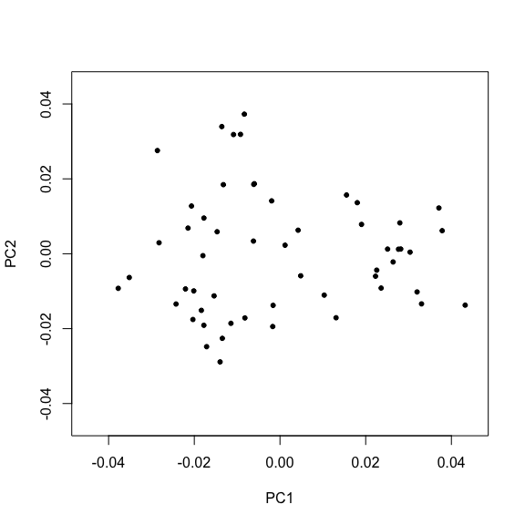<!-- -->

## PCA as a projection.

- So somehow we have generated these new variables called PC1, PC2 etc. But what are they?
- You have probably heard them described as weighted linear combinations of the original variables, or as "loadings"
- But they are simply projections of the observed data (shape) onto the vectors defined by the PCA (the eigenvectors).

- It is too big to look at all of them here, so let's just look at the vector of the loadings for PC1 (eigenvector associated with 1st eigenvalue)


```r
pupfish_pca$rotation[,1]
```

```
##   [1] -0.142728 -0.207510 -0.066359 -0.218241 -0.103252 -0.178286  0.057813
##   [8]  0.001324 -0.124604  0.212261 -0.075482  0.047274 -0.069321 -0.037797
##  [15] -0.195437 -0.158322 -0.046198 -0.125353  0.059421 -0.002701  0.022927
##  [22] -0.038479  0.023207 -0.044235  0.015478 -0.037779 -0.000455 -0.006914
##  [29] -0.009661  0.009204 -0.022482  0.040512 -0.033445  0.071888 -0.042924
##  [36]  0.106136 -0.049115  0.157927 -0.045770  0.192183 -0.034149  0.218966
##  [43] -0.016997  0.221046 -0.008776  0.209862  0.033276  0.188221  0.033086
##  [50]  0.174160  0.026715  0.161466  0.015393  0.139588  0.005829  0.122713
##  [57] -0.007679  0.093437 -0.018674  0.063459 -0.028809  0.022495 -0.034962
##  [64]  0.002831 -0.037752 -0.017890 -0.040192 -0.155578 -0.027931 -0.136940
##  [71] -0.020691 -0.121196 -0.018151 -0.114687 -0.015508 -0.107230  0.085884
##  [78] -0.127458  0.070967 -0.000864  0.095598 -0.028824  0.092114 -0.047055
##  [85]  0.082380 -0.049003  0.081559 -0.075040  0.047217 -0.089345  0.009553
##  [92] -0.106758 -0.020893 -0.084998  0.241493 -0.164228  0.001202 -0.010460
##  [99]  0.009582  0.007431  0.033841 -0.000723  0.012628 -0.016579  0.000594
## [106]  0.042413  0.071059  0.059329  0.095948 -0.014003  0.033637 -0.041649
```

- A loading for each landmark coordinate (for x,y pairs)

## PCA as a projection

- The PCA scores we use are simply projections of the original shape data onto these vectors. prcomp has already made these unit vectors, so we don't even need to scale this eigenvector first (but it won't cause a problem in this case either)

- Let's just do the first individual as a check

```r
projFunction(x = Pupfish$coords[1,], # first individual
             y = pupfish_pca$rotation[,1]) # eigenvector we are projecting onto
```

```
##         [,1]
## [1,] -0.0203
```

```r
# and the value for PC1 for this individual according to prcomp?
pupfish_pca$x[1,1]
```

```
##     PC1 
## -0.0203
```

## making an easier go of it
- We don't want to do these one at a time of course.
- Using the fact that that the eigenvectors are already of length 1, we can just use the "numerator". 


```r
PC_scores = Pupfish$coords %*% pupfish_pca$rotation 

par(mfrow = c(1,2))
plot( y = pupfish_pca$x[,2], x =  pupfish_pca$x[,1],
      pch = 20, ylab = "PC2", xlab = "PC1",
      xlim = c(-0.045, 0.045), ylim = c(-0.045, 0.045),
      main = "prcomp")

plot( y = PC_scores[,2], x =  PC_scores[,1],
      pch = 20, ylab = "PC2", xlab = "PC1", col = "blue",
      xlim = c(-0.045, 0.045), ylim = c(-0.045, 0.045),
      main = "by hand")
```

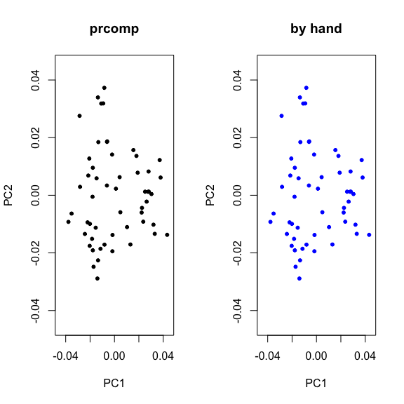<!-- -->

```r
par(mfrow = c(1,1))
```

## principal components analysis and projections, achievement unlocked!
- Well that is fairly awesome, how else can I use projections?

## Allometry "shape scores" are just a projection
- We commonly use the method first (I think) advocated by Abby Drake and Chris Klingenberg back in 2008 to visualize allometric patterns.
- What they recommended is simply:
 + Regressing shape (procrustes residuals) on size
 + Extract the allometry vector (coefficients associated with size)
 + Project shape onto the allometry vector to compute the (scalar) "shape score"
 + Then regress the shape score back onto size.

## Allometry "shape scores" are just a projection
- To illustrate we will use a simplified example with the pupfish.
- We are (for purposes of clarity) ignoring all other predictors, and are just using centroid size.


```r
mod_shape_wAllometry_reduced <- procD.lm(coords ~ 1 + logCS_c, 
                         data = Pupfish, 
                         print.progress = FALSE,  
                         iter = 9)


plot(mod_shape_wAllometry_reduced, type = "regression", 
     predictor = Pupfish$logCS_c, 
     reg.type = "RegScore",
     xlab = "logCS (centered)",
     pch = 20, col = "blue")

#equivalently
plotAllometry(mod_shape_wAllometry_reduced, 
     method = "RegScore", 
     size = Pupfish$logCS_c, logsz = F,
     xlab = "logCS (centered)",
     pch = 20, col = "blue")
```

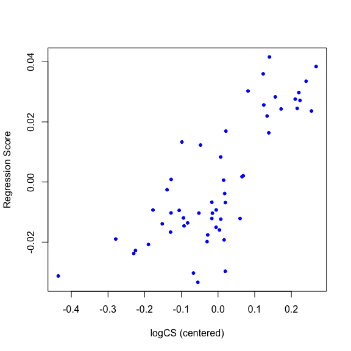<!-- -->


## DIY allometry "shape scores" using what we have learned.

- Let's do this ourselves:
- First we extract the coefficients from the model associated with size as a predictor.


```r
coef(mod_shape_wAllometry_reduced)[ , 1:6] # we want the second row
```

```
##                [,1]    [,2]     [,3]    [,4]     [,5]    [,6]
## (Intercept) -0.0395 -0.0706 -0.04146 -0.0371  0.09922 -0.0705
## logCS_c     -0.0181 -0.0198 -0.00905 -0.0276 -0.00537 -0.0162
```

```r
allom_vec <- coef(mod_shape_wAllometry_reduced)[2,]
```

- this allometry vector will not be of unit length! 

```r
norm(allom_vec, type = "2")
```

```
## [1] 0.111
```

## DIY allometry "shape scores" using what we have learned.

- Now we project our observed shape data (procrustes residuals) onto the allometry vector.


```r
reg_score <- projFunction(y = allom_vec, 
                          x = Pupfish$coords)

# which returns one value (scalar) per observation
length(reg_score)
```

```
## [1] 54
```

```r
plot(reg_score ~ Pupfish$logCS_c,
     ylab = "allometry regression score",
     xlab = "logCS (centered)",
     main = "DIY allometry shape scores!",
     pch = 20)
```

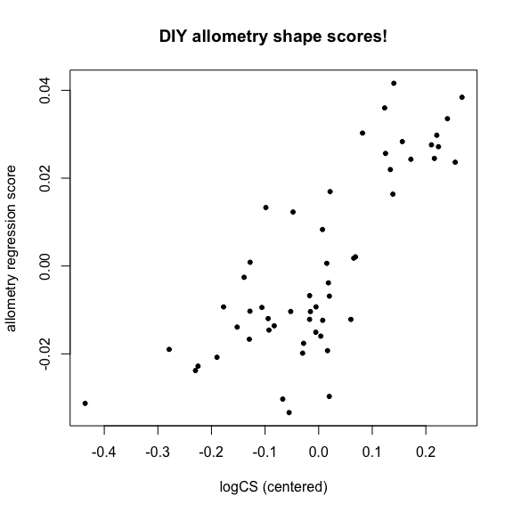<!-- -->

## PC plots of fitted values in procD.lm also a projection
- I won't show it here, but when you use  in plot.procD.lm this just does a PCA on the fitted values, and then projects the observed shape onto these vectors.

## roll your own "shape scores"
- Let's pretend (? - maybe it has) that something evolutionary cool has happened between the Marsh and sinkhole populations. 
- For instance, the Marsh population represents something similar to the "ancestral" environment with lots of predation.
- The sinkhole is a derived population (again I am pretending, no idea if this is true), where there are no predators. Relaxed from this selective pressure, the relative contribution of sexual selection increases. 
- So we may want to ask a question about how this has influenced the degree of sexual shape dimorphism.
- In particular we could ask how sexual shape dimorphism has changed across the populations

## sexual shape dimorphism score
- We could of course just use the magnitudes and vector correlations to get a pretty useful answer.
- But if we wanted to more directly relate this to ancestral patterns of SShD, then we can construct a sexual shape dimorphism vector from the Marsh population to project onto.

## sexual shape dimorphish vector
- It turns out we already computed vector (twice).
- We can use either of them in this case.


```r
sex_difference_marsh[1:4] # difference vectors from LSmeans for M and F
```

```
## [1] 0.00795 0.00681 0.00465 0.00556
```

```r
mod_shape_II$coefficients[3, 1:4] # treatment contrast
```

```
## [1] -0.00795 -0.00681 -0.00465 -0.00556
```

- We proceed by projecting observed shape data onto this sexual dimorphism vector.


```r
SShD_score <- projFunction(y = mod_shape_II$coefficients[3, ], 
                          x = Pupfish$coords)
```

## plotting our sexual shape dimorphism score


```r
ggplot(pupfish_dat, 
       aes(y = SShD_score, col = Pop:Sex)) + geom_boxplot()
```

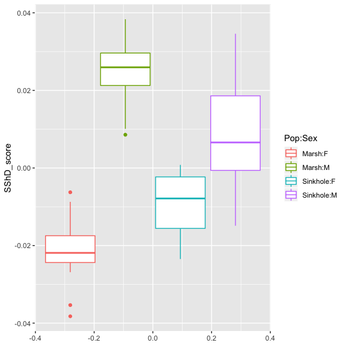<!-- -->

- Note that the magnitude of the differences for this Marsh SShD score is less for the sinkhole than Marsh population.
- Are you surprised by this? Does this mean there is less SShD in the sinkhole population?

## interpreting our Marsh sexual shape dimorphism score
-  We defined our SShD score by using the differences defined by the Marsh Population. 
- So it does not necessarily mean that SShD is less in the sinkhole population, it just may be oriented in a different direction that that of the Marsh population.

- We actually calculated the vector correlation earlier to look at the direction between these vectors. Similar, but hardly identical.


```r
cor(sex_difference_hole, sex_difference_marsh)
```

```
## [1] 0.739
```

- We could look more directly at the magnitudes of SShD within each population

```r
summary.pairwise(shape_pairwise_interaction, 
                 test.type = "dist") 
```

```
## 
## Pairwise comparisons
## 
## Groups: Marsh.F Sinkhole.F Marsh.M Sinkhole.M 
## 
## RRPP: 10 permutations
## 
## LS means:
## Vectors hidden (use show.vectors = TRUE to view)
## 
## Pairwise distances between means, plus statistics
##                            d UCL (95%)       Z Pr > d
## Marsh.F:Sinkhole.F    0.0330    0.0326  1.1900    0.1
## Marsh.F:Marsh.M       0.0461    0.0443  1.7021    0.1
## Marsh.F:Sinkhole.M    0.0388    0.0451 -0.6015    0.7
## Sinkhole.F:Marsh.M    0.0461    0.0492  0.0592    0.7
## Sinkhole.F:Sinkhole.M 0.0257    0.0395 -1.7349    1.0
## Marsh.M:Sinkhole.M    0.0280    0.0320 -0.0906    0.6
```

- In this case, the Marsh population actually does have a greater magnitude for SShD (ignoring things like allometry, and how distinct these populations are etc).

## A word of warning when you have more landmarks than specimens.
- You may notice that our shape score perfectly seperates males and females from the Marsh population.
- A great deal of caution must be used interpreting this. We are in a situation where the number of landmark coordinates (56 2D landmarks = 112 features) exceeds the number of observations.
- This means in this high dimensional space we are guaranteed to be able to fine a plane that completely seperates the males and females.

## A word of warning when you have more landmarks than specimens.
- Thankfully there are a number of "solutions" that usually work.
- One tried and true method is to reduce the shape data to a lower number of dimensions using PCA, so that the number of dimensions retained is less than the number of observations.
- Then use these PCA to generate the difference vector as project onto that.
- You can then use a back transformation to recover data as coordinates in this lower dimensional space.
- I did not add it here, but I have an example I can show for the backtransform.
- You can also employ regularization (lasso, ridge or elastic net) while fitting the model to define the contrast vector.  Use the family = "mgaussian" argument in the glmnet function in the glmnet library.

## Things to discuss
- For purposes of time (and not wanting to write or speak more) I will leave it here.
- However we can discuss other issues like using discriminant functions as a form of a project but scaled differently (by the inverse of the pooled covariance matrix). This can be MORE useful for classification purposes, but it has some issues that need to be considered (squishing effects, how to invert the covariance matrix of landmarks (generalized inverse, bending/regularizing the covariance matrix)).
- A highly related issue is for important evolutionary quantities like selection gradients. We can discuss this too.

